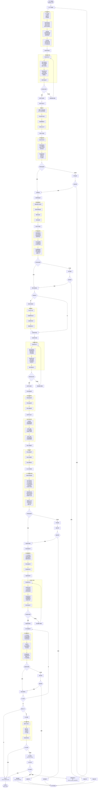

# DIP 产线执行流程

> **版本**: v1.0 - 初始完整版
> **来源**: 用户提供的流程图，经补全闭环和标注统一

---

```mermaid
flowchart TD
    Start([“DIP工单接收<br>来自SMT工序”]) --> A[“DIP产线准备”]
    
    subgraph A_Sub [产线准备项目]
        direction TB
        A1[“PCB板接收<br>• 工单确认<br>• 数量核对<br>• 外观抽检”]
        A2[“插件物料准备<br>• 物料齐套检查<br>• 操作指引调出<br>• 操作员培训确认”]
        A3[“设备准备<br>• 波峰焊参数设置<br>• 预热温度设置<br>• 助焊剂检查”]
        A4[“夹具准备<br>• 夹具寿命检查<br>• 使用次数计算<br>• TPM系统关联”]
        
        A1 --> A2 --> A3 --> A4
    end
    
    A --> A1
    
    A4 --> B[“插件首件检查”]
    
    subgraph B_Sub [插件首件流程]
        direction TB
        B1[“插件首件生产”]
        B2[“首件全面检查<br>• 插件位置精度<br>• 元件完整性<br>• 极性方向确认”]
        B3[“检查结果记录<br>• 首件检查表<br>• 缺陷拍照存档<br>• 参数确认”]
        B4[“首件审批放行”]
        
        B1 --> B2 --> B3 --> B4
    end
    
    B --> B1
    
    B4 --> C{"首件是否合格?"}
    C -->|合格| D["插件作业授权"]
    C -->|不合格| E["参数调整与重做"]
    E --> B1
    
    D --> F[“插件作业执行”]
    
    subgraph F_Sub [插件方式]
        F1[“根据工艺路由选择<br>AI/手工/异形件插件”]
        F2[“作业指导书显示”]
        F3[“防错提醒系统”]
        F4[“自检记录上传”]
        
        F1 --> F2 --> F3 --> F4
    end
    
    F --> F1
    
    F4 --> G[“炉前AOI检查”]
    
    subgraph G_Sub [炉前检查流程]
        direction TB
        G1[“自动扫码识别”]
        G2[“插件质量检查<br>• 元件位置检查<br>• 缺失元件检测<br>• 极性检查”]
        G3[“检查数据绑定<br>• 缺陷记录<br>• 图片存档<br>• 产品绑定”]
        
        G1 --> G2 --> G3
    end
    
    G --> G1
    
    G3 --> H{“炉前检查结果”}
    H -->|合格| I[“波峰焊接”]
    H -->|不合格| J[“炉前返修”]
    
    J --> K{“返修结果”}
    K -->|合格| I
    K -->|报废| L[“报废处理”]
    L --> End1([“DIP异常结束”])
    
    I --> M[“波峰焊接监控”]
    
    subgraph M_Sub [焊接过程监控]
        direction TB
        M1[“焊接参数实时监控”]
        M2[“助焊剂管理监控”]
        M3[“预热区监控”]
        M4[“冷却区监控”]
        
        M1 --> M2 --> M3 --> M4
    end
    
    M --> M1
    
    M4 --> N[“炉后AOI检查”]
    
    subgraph N_Sub [炉后检查流程]
        direction TB
        N1[“焊接质量检查<br>• 焊点外观检查<br>• 连锡/虚焊检测<br>• 透锡率检查”]
        N2[“元件状态检查<br>• 元件偏移检查<br>• 元件损坏检查”]
        N3[“检查数据绑定<br>• 缺陷分类统计<br>• 不良位置标记<br>• 数据上传”]
        
        N1 --> N2 --> N3
    end
    
    N --> N1
    
    N3 --> O{“炉后检查结果”}
    O -->|合格| P[“物料切换检查”]
    O -->|不合格| Q[“炉后返修”]
    
    Q --> R{“返修结果”}
    R -->|合格| P
    R -->|报废| S[“报废处理”]
    S --> End1
    
    P --> T{“是否换料?”}
    T -->|是| U[“换料处理流程”]
    T -->|否| V[“后焊首件检查”]
    
    subgraph U_Sub [换料处理]
        direction TB
        U1[“停止生产线”]
        U2[“扫描新物料批次”]
        U3[“记录换料信息”]
        U4[“更新物料批次”]
        
        U1 --> U2 --> U3 --> U4
    end
    
    U --> U1
    U4 --> V
    
    V --> W[“后焊首件流程”]
    
    subgraph W_Sub [后焊首件检查]
        direction TB
        W1[“后焊首件生产”]
        W2[“首件全面检查<br>• 焊接质量检查<br>• 组装完整性<br>• 三防漆效果”]
        W3[“检查结果记录<br>• 首件检查表<br>• 关键参数确认<br>• 拍照存档”]
        W4[“首件审批放行”]
        
        W1 --> W2 --> W3 --> W4
    end
    
    W --> W1
    
    W4 --> X{“首件是否合格?”}
    X -->|合格| Y["后焊作业授权"]
    X -->|不合格| Z["参数调整与重做"]
    Z --> W1
    
    Y --> AA[“后焊设备设置”]
    
    subgraph AA_Sub [后焊设备参数]
        direction TB
        AA1[“烙铁温度设置”]
        AA2[“喷涂设备设置”]
        AA3[“固化设备设置”]
        
        AA1 --> AA2 --> AA3
    end
    
    AA --> AA1
    
    AA3 --> BB[“后焊作业执行”]
    
    subgraph BB_Sub [后焊三大步骤]
        direction TB
        BB1[“执锡返修<br>• 烙铁温度监控<br>• 焊接质量控制”]
        BB2[“后焊与组装<br>• 手工焊接控制<br>• 剪脚作业管理”]
        BB3[“喷涂三防漆<br>• 喷涂参数监控<br>• 涂层厚度控制”]
        
        BB1 --> BB2 --> BB3
    end
    
    BB --> BB1
    
    BB3 --> CC[“固化过程监控”]
    
    subgraph CC_Sub [固化监控]
        direction TB
        CC1[“固化温度监控”]
        CC2[“固化时间控制”]
        CC3[“固化结果检测”]
        
        CC1 --> CC2 --> CC3
    end
    
    CC --> CC1
    
    CC3 --> DD[“100%外观检查”]
    
    subgraph DD_Sub [人工外观检查流程]
        direction TB
        DD1[“调用外观检查表”]
        DD2[“执行检查项目<br>• 焊点外观检查<br>• 元件安装检查<br>• 三防漆涂层检查<br>• 清洁度检查<br>• 标签标识检查”]
        DD3[“检查结果记录<br>• 调用标准检查表<br>• 提取关键字段<br>• 缺陷照片记录”]
        DD4[“质量统计分析<br>• 缺陷类型统计<br>• 不良率计算<br>• 趋势分析”]
        
        DD1 --> DD2 --> DD3 --> DD4
    end
    
    DD --> DD1
    
    DD4 --> EE{“外观检查结果”}
    EE -->|合格| FF[“功能测试准备”]
    EE -->|不合格| GG[“外观返修”]
    
    GG --> HH[“返修处理”]
    HH --> II{“返修结果”}
    II -->|合格| FF
    II -->|报废| JJ[“最终报废”]
    JJ --> End1
    
    FF --> KK[“测试设备点检”]
    
    subgraph KK_Sub [测试设备准备]
        direction TB
        KK1[“ICT夹具检查<br>• 夹具寿命管理<br>• 使用次数统计<br>• 接触性能测试”]
        KK2[“测试设备校准”]
        KK3[“测试程序验证”]
        
        KK1 --> KK2 --> KK3
    end
    
    KK --> KK1
    
    KK3 --> LL[“功能测试首件”]
    
    subgraph LL_Sub [测试首件流程]
        direction TB
        LL1[“测试首件执行”]
        LL2[“全面测试验证<br>• ICT测试验证<br>• 功能测试验证<br>• 安全测试验证”]
        LL3[“测试结果分析<br>• 测试数据确认<br>• 性能参数验证<br>• 标准符合性”]
        LL4[“首件测试放行”]
        
        LL1 --> LL2 --> LL3 --> LL4
    end
    
    LL --> LL1
    
    LL4 --> MM{“测试首件结果”}
    MM -->|合格| NN[“批量测试授权”]
    MM -->|不合格| OO["测试调整与重做"]
    OO --> LL1
    
    NN --> PP[“执行批量测试”]
    
    subgraph PP_Sub [测试项目执行]
        direction TB
        PP1["ICT在线测试<br>• 测试夹具管理<br>• 测试数据采集<br>• 不良自动标记"]
        PP2["功能测试<br>• FCT测试执行<br>• 性能参数验证<br>• 安全测试"]
        PP3["测试数据绑定<br>• 测试结果记录<br>• 数据上传<br>• 产品追溯绑定"]

        PP1 --> PP2 --> PP3
    end

    PP --> PP1

    PP3 --> QQ{"批量测试结果"}
    QQ -->|合格| RR["测试完成确认"]
    QQ -->|不合格| SS["测试返修"]

    SS --> TT{"返修结果"}
    TT -->|合格| RR
    TT -->|报废| UU["报废处理"]
    UU --> End1

    RR --> VV{Run完成?}
    VV -->|否| PP
    VV -->|是| WW{触发OQC?}

    WW -->|否| XX["DIP完工<br>RUN=COMPLETED"]
    WW -->|是| YY["OQC抽检"]

    subgraph YY_Sub [OQC抽检流程]
        direction TB
        YY1["抽样计划执行"]
        YY2["抽样检验<br>• 外观复检<br>• 功能复测<br>• 尺寸检查"]
        YY3["检验结果判定"]

        YY1 --> YY2 --> YY3
    end

    YY --> YY1

    YY3 --> ZZ{OQC结果?}
    ZZ -->|合格| XX
    ZZ -->|不合格| AAA["批次隔离<br>RUN=ON_HOLD"]

    AAA --> BBB["MRB评审"]
    BBB --> CCC{MRB决策?}
    CCC -->|放行| XX
    CCC -->|返修| DDD["创建返修批次<br>原RUN=CLOSED_REWORK"]
    DDD --> A
    CCC -->|报废| EEE["整批报废<br>RUN=SCRAPPED"]
    EEE --> End1

    XX --> End2(["DIP完工<br>转入下工序"])
```
