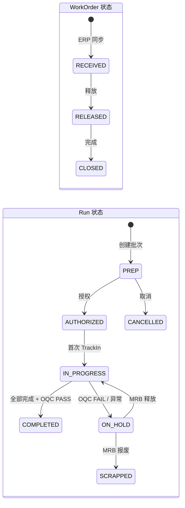

# 工单到批次（WorkOrder → Run）

## 1. 目的
描述 SMT 流程中“工单下达 → 工单释放 → 批次创建”的完整数据链条，并明确每一步的数据如何产生、如何管理。

## 2. 流程位置（对应 SMT 流程图）
- `ERP/APS 工单下达` → `工单接收 (WO=RECEIVED)` → `工单释放 (WO=RELEASED)` → `创建批次 (Run=PREP)`

## 3. 数据如何产生
### 3.1 工单（WorkOrder）
- 来源：ERP/APS 下达后同步到 MES。
- 核心字段：
  - `woNo` 工单号
  - `productCode` 产品编码
  - `routingId`（可选）指定工艺路由
  - `qty` 计划数量
  - `status` 工单状态（RECEIVED/RELEASED 等）

### 3.2 批次（Run）
- 来源：由计划/生管在 MES 创建，绑定工单。
- 核心字段：
  - `runNo` 批次号
  - `workOrderId` 关联工单
  - `lineId` 产线
  - `routeVersionId` 冻结的执行路由版本
  - `status` 初始为 PREP

## 4. 数据如何管理
### 4.1 工单管理规则
- 工单必须先进入 RELEASED（已释放）状态，才允许创建批次。
- 工单的 `productCode` 与 `routingId` 是后续上料和执行的关键来源。

### 4.2 批次管理规则
- Run 创建时绑定一条"已编译"的 ExecutableRouteVersion。
- Run 绑定的路由版本是冻结快照，后续路由更新不影响已创建 Run。
- Run 状态流转：PREP → AUTHORIZED → IN_PROGRESS → COMPLETED/ON_HOLD/…

### 4.3 状态流转图

**说明**：
- WorkOrder 必须为 `RELEASED` 才能创建 Run
- Run 创建后初始状态为 `PREP`
- `ON_HOLD` 通常由 OQC 失败或异常触发，需 MRB 决策后继续

## 5. 真实例子（中文）
### 5.1 工单
- 工单号：`WO-20250526-001`
- 产品编码：`5223029018`
- 路由：`SMT-BOT-标准路由`
- 计划数量：`400`

### 5.2 批次
- 批次号：`RUN-WO-20250526-001-01`
- 产线：SMT-A
- 状态：PREP
- 绑定路由版本：`SMT-BOT-标准路由 v3 (READY)`

## 6. 演示数据生成建议
- 至少准备 1 个 RELEASED 状态工单。
- 该工单下创建 1~2 个 Run（同产品但不同产线/路由版本）。
- 确保 Run 绑定 READY 的路由版本，否则创建失败。

## 7. 验证步骤（预览）
- 在 `/mes/runs` 创建 Run，检查：
  - 绑定了正确的 `productCode`
  - 绑定了正确的 `routeVersionId`
  - 状态为 PREP

详细验证见 `05_validation/02_run_and_execution_validation.md`。
