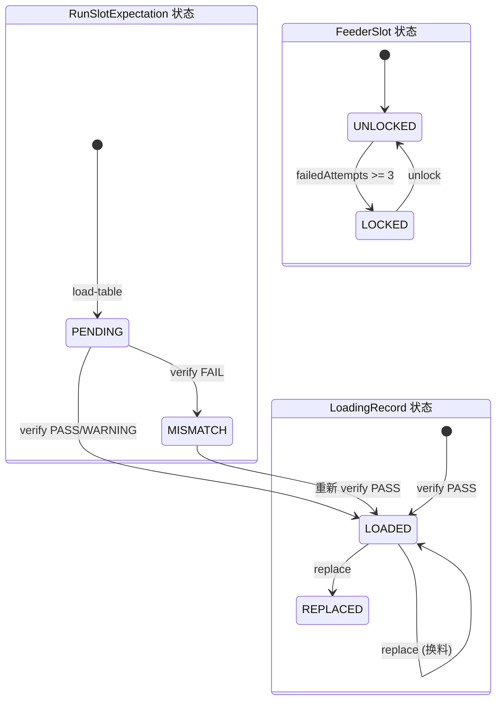

# 上料防错流程（加载站位表 / 扫码验证 / 换料）

## 1. 目的
描述 SMT 上料防错的完整流程，以及每一步数据如何产生与管理，确保可生成真实演示数据和可重复的验证步骤。

## 2. 流程位置（对应 SMT 流程图）
- `上料防错` 子流程：
  - B1 加载站位表
  - B2 扫码验证
  - B3 验证结果
  - B4 确认上料（系统通过即写入记录）
  - B5 报警/锁定/重试

## 3. 前置条件
- Run 必须为 `PREP` 状态。
- Run 已绑定产线（lineId）。
- 产线已配置站位（FeederSlot）。
- 站位已配置物料映射（SlotMaterialMapping）。

## 3.1 上料流程状态图

**关键规则**：
- 站位连续 3 次扫码失败 → 自动锁定
- 已 LOADED 的站位不能再次 verify，必须使用 replace
- 换料时旧记录标记为 REPLACED，新记录写入

## 4. 加载站位表（B1）
### 4.1 数据如何产生
- 触发接口：`POST /api/runs/:runNo/loading/load-table`
- 系统读取：
  - 产线所有站位（FeederSlot）
  - 站位映射（SlotMaterialMapping）
  - Run 绑定的路由版本（routeVersionId）
  - 工单产品编码（productCode）
- 生成数据：`RunSlotExpectation`（批次级“期望上料清单”）

### 4.2 生成规则（简化）
- 对每个站位选出最匹配的映射：
  - 同时匹配产品 + 路由优先
  - 其次匹配通用映射
  - 以 `priority` 最小为主料，其余为替代料

### 4.3 关键输出
- 每个站位生成 1 条 `RunSlotExpectation`：
  - `expectedMaterialCode`
  - `alternates`（替代料）
  - `status = PENDING`

### 4.4 关键限制
- 若已存在 LoadingRecord（说明上料已开始），加载失败。
- 若任何站位缺少映射，加载失败并返回缺失站位清单。

## 5. 扫码验证（B2-B4）
### 5.1 数据如何产生
- 触发接口：`POST /api/loading/verify`
- 输入：`runNo + slotCode + materialLotBarcode (+ operatorId)`
- 条码格式：`物料编码|批次号`

### 5.2 验证规则（简化）
- 找到当前 Run 的站位期望（RunSlotExpectation）。
- 解析条码得到 `materialCode + lotNo`：
  - 若能解析：自动 upsert MaterialLot
  - 若不能解析：按 `lotNo` 查找，找不到即报错
- 判断结果：
  - 期望物料 → PASS（LOADED）
  - 替代物料 → WARNING（LOADED）
  - 不匹配 → FAIL（UNLOADED）

### 5.3 幂等与防错
- 若站位已 LOADED，再扫相同物料：返回已有记录（幂等）。
- 若站位已 LOADED，再扫不同物料：提示使用“换料”流程。
- 连续错误 3 次 → 站位锁定，必须手动解锁。

### 5.4 写入的数据
- `RunSlotExpectation`：
  - 通过时写入 `loadedMaterialCode/loadedAt/loadedBy` 并设为 LOADED
  - 失败时设为 MISMATCH
- `FeederSlot`：
  - 通过时清零失败次数并解除锁定
  - 失败时递增失败次数，必要时锁定
- `LoadingRecord`：
  - 记录扫码物料批次、验证结果、时间、人员

## 6. 换料流程（B5 延伸）
### 6.1 触发条件
- 站位已 LOADED，但需要更换物料批次。

### 6.2 数据如何产生
- 触发接口：`POST /api/loading/replace`
- 必填：`reason`（换料原因）
- 系统行为：
  - 将旧的 LOADED 记录标记为 REPLACED
  - 写入新的 LoadingRecord，记录替换原因

### 6.3 数据如何管理
- `LoadingRecord.meta.replaceReason` 保存换料原因。
- 换料失败会增加失败次数，仍可能触发站位锁定。

## 7. 解锁站位
- 触发接口：`POST /api/feeder-slots/:slotId/unlock`
- 必填：`reason` + `operatorId`
- 系统会清零失败次数并记录解锁历史。

## 8. 真实例子（中文）
**站位表（QR‑Pro‑121）片段**：
- 站位 `2F-46` 期望物料 `5212090001`

**扫码上料**：
- 扫码 `2F-46 + 5212090001|LOT-20250526-001` → PASS
- 再次扫码同一物料 → 幂等返回
- 扫码 `2F-46 + 5212090001B|LOT-20250526-002` → WARNING（替代料）
- 扫码 `2F-46 + 5212099999|LOT-20250526-009` → FAIL + 锁定

**换料记录（QR‑Mac‑022 对应字段）**：
- 换料位置：`2F-46`
- 零件编码：`5212090001`
- 包装数量：`4000`
- 换料人/审核：记录在 LoadingRecord

## 9. 演示数据生成建议
- 至少准备：
  - 1 个正确上料案例（PASS）
  - 1 个替代料案例（WARNING）
  - 1 个错误案例（FAIL + 锁定）
  - 1 个换料案例（REPLACED）

## 10. 验证步骤（预览）
- 验证加载站位表失败场景（缺映射 / 已上料）。
- 验证 PASS/WARNING/FAIL 结果与记录一致。
- 验证锁定与解锁流程。

详细验证见 `05_validation/01_loading_validation.md`。
