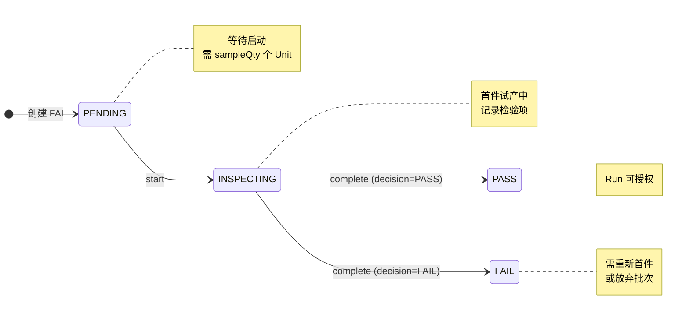

# 首件流程（FAI）

## 1. 目的
描述 SMT 首件（FAI）在系统中的创建、执行、判定与数据管理方式，便于生成演示数据与验证步骤。

## 2. 流程位置（对应 SMT 流程图）
- 上料完成 → `创建 FAI (FAI=PENDING)` → 首件生产/检验 → 首件判定 → 通过后可授权批量生产。

## 3. 前置条件
- Run 状态必须为 `PREP`。
- 就绪检查（Formal）必须通过。
- Run 已生成足够的 Unit（样本数量需满足）。

## 3.1 FAI 状态流转图

**Gate 逻辑**：
- 若路由要求 FAI（`faiRequired=true`），则 Run 授权前必须有 `FAI.status=PASS`
- 若 FAI FAIL，Run 无法授权，需创建新 FAI 或取消批次

## 4. 数据如何产生
### 4.1 创建 FAI
- 入口：`POST /api/fai/run/:runNo`
- 输入：`sampleQty`（样本数，>=1），可选 `remark`。
- 生成数据：Inspection 记录（类型 FAI）。
- 失败场景：
  - Run 不是 PREP
  - 就绪检查未通过
  - 样本数量不足
  - 已存在未完成 FAI

### 4.2 启动 FAI
- 入口：`POST /api/fai/:faiId/start`
- 作用：状态从 PENDING → INSPECTING，记录开始时间/人员。

### 4.3 首件试产（FAI Trial）
- 系统要求在 FAI 开始后，完成 `sampleQty` 个 Unit 的 TrackIn/TrackOut。
- 这些 Track 作为首件试产记录，可用于后续判定。

### 4.4 记录检验项
- 入口：`POST /api/fai/:faiId/items`
- 样例字段：
  - `unitSn`（样本 SN，可选）
  - `itemName`（检验项名称）
  - `itemSpec`（规范/标准）
  - `actualValue`（实测值）
  - `result`（PASS/FAIL/NA）
  - `defectCode`（不良代码）
  - `remark`

### 4.5 完成判定
- 入口：`POST /api/fai/:faiId/complete`
- 输入：`decision`（PASS/FAIL）、`passedQty/failedQty`、`remark`。
- 规则：
  - PASS 时 failedQty 必须为 0
  - FAIL 时 failedQty 必须 > 0
  - 若 PASS 但存在 SPI/AOI 检验 FAIL，则不允许完成

## 5. 数据如何管理
- FAI 状态流转：PENDING → INSPECTING → PASS/FAIL。
- FAI 与 Run 绑定，授权前需通过 FAI gate（路由要求时）。
- 试产 TrackIn/TrackOut 与检验项数据用于追溯。

## 6. 真实例子（中文）
- 创建 FAI：样本数 2
- 首件试产：完成 2 个 Unit 的 TrackOut
- 记录检验项：
  - “锡膏厚度” PASS
  - “焊点质量” PASS
- 判定：PASS → Run 可授权

## 7. 演示数据生成建议
- 准备 1 个 PASS 场景（样本数 = 2）。
- 准备 1 个 FAIL 场景（存在检验 FAIL 或 failedQty>0）。
- 模拟 SPI/AOI 失败场景，验证 PASS 被阻断。

## 8. 验证步骤（预览）
- 创建 FAI 是否要求就绪检查通过。
- 检查试产数量不足时的错误提示。
- PASS/FAIL 统计规则与 SPI/AOI 失败阻断逻辑。

详细验证见 `05_validation/02_run_and_execution_validation.md`。
