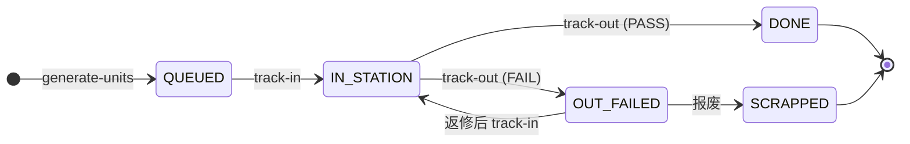

# 执行与追溯（TrackIn/TrackOut → Trace）

## 1. 目的
描述 SMT 批量执行阶段的核心数据链条，以及追溯输出的结构与来源，便于生成真实演示数据与验证步骤。

## 2. 流程位置（对应 SMT 流程图）
- Run 授权后进入批量执行（TrackIn → TrackOut → PASS/FAIL）。
- 执行过程产生追溯数据（tracks/dataValues/inspections/loadingRecords）。

## 3. 前置条件
- Run 已授权（AUTHORIZED）
- 若路由要求 FAI，需 FAI=PASS
- 已生成 Unit（单件 SN）

## 3.1 Unit 状态流转图

**关键规则**：
- Unit 初始状态为 `QUEUED`
- TrackIn 将状态变为 `IN_STATION`
- TrackOut 根据结果变为 `DONE` 或 `OUT_FAILED`
- `OUT_FAILED` 的 Unit 需要处置（返修/报废）才能继续

## 4. 数据如何产生
### 4.1 生成 Unit（单件）
- 入口：`POST /api/runs/:runNo/generate-units`
- 规则：
  - 仅允许 Run 状态为 PREP 或 AUTHORIZED
  - 生成数量不能超过 planQty
  - SN 自动生成（默认前缀 `SN-${runNo}-`）
  - Unit 初始状态：QUEUED

### 4.2 TrackIn / TrackOut
- 入口：
  - `POST /api/stations/:stationCode/track-in`
  - `POST /api/stations/:stationCode/track-out`
- 产生数据：
  - Track 记录（每次执行的入站/出站）
  - Unit 状态变更（QUEUED → IN_STATION → DONE/OUT_FAILED 等）
- 关键约束（来自路由与执行语义）：
  - 必须匹配 Run 绑定的路由版本
  - Station 必须符合路由步骤的 stationType/约束
  - 需要的数据采集项必须齐全

### 4.3 数据采集（可选）
- TrackOut 时可写入 DataValue（如炉温、AOI 结果）。
- 结果会进入 Trace 输出。

### 4.4 质量结果
- SPI/AOI 检验结果会记录为 InspectionResultRecord。
- 这些结果会影响 FAI 判定与 Trace 输出。

## 5. 数据如何管理
- Unit + Track + DataValue 属于运行数据，不可随意修改。
- Trace 输出为只读视图，默认基于 Run 冻结路由版本。
- 路由更新不会影响历史 Trace。

## 6. 追溯输出结构（摘要）
`GET /api/trace/units/{sn}` 返回：
- `unit`：SN、状态、工单/批次
- `route` + `routeVersion`：冻结版本信息
- `steps`：步骤与执行语义
- `tracks`：执行轨迹
- `dataValues`：采集数据
- `inspections`：FAI/OQC 摘要
- `loadingRecords`：上料记录（站位/物料/批次）

## 7. 真实例子（中文）
- Run：`RUN-WO-20250526-001-01`
- 生成 Unit：`SN-RUN-WO-20250526-001-01-0001`
- 在 SMT-AOI 工位 TrackIn/TrackOut → PASS
- Trace 查询结果包含：
  - 站位上料记录（slot/material/lot）
  - AOI 检验结果
  - 执行轨迹与路由版本

## 8. 演示数据生成建议
- 准备 3 个 Unit：
  - 1 个 PASS 流程完整单件
  - 1 个 FAIL（OUT_FAILED）
  - 1 个中途停留（IN_STATION）
- 确保 Trace 查询可看到 loadingRecords + inspections + tracks。

## 9. 验证步骤（预览）
- 验证生成 Unit 的数量与 SN 连续性。
- 验证 TrackIn/TrackOut 产生的状态变化。
- 验证 Trace 输出的 routeVersion 冻结与加载记录。

详细验证见 `05_validation/02_run_and_execution_validation.md` 与 `05_validation/03_traceability_validation.md`。
