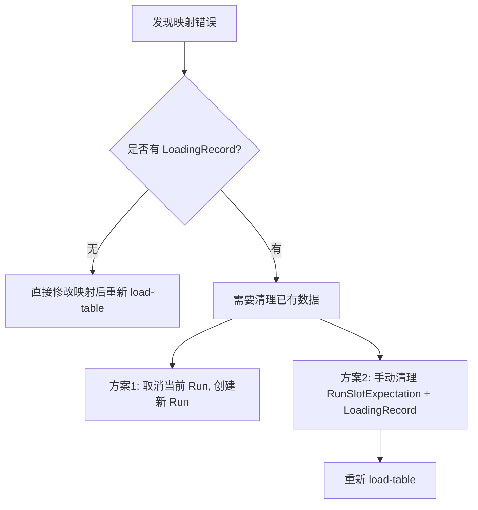
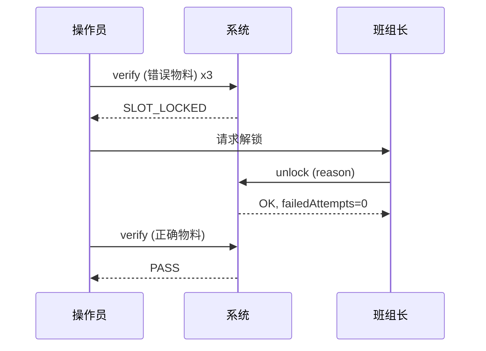
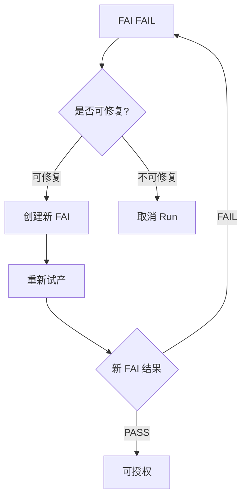
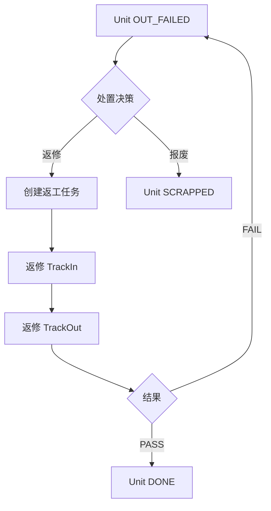

# 异常处理与回滚场景

## 1. 概述

本文档描述 SMT 流程中可能遇到的异常场景、系统行为、以及恢复/回滚方式。

---

## 2. 上料阶段异常

### 2.1 站位表加载失败

| 场景 | 错误码 | 系统行为 | 恢复方式 |
|------|--------|---------|---------|
| Run 不存在 | `RUN_NOT_FOUND` | 拒绝操作 | 确认 runNo 正确 |
| Run 非 PREP 状态 | `RUN_NOT_IN_PREP` | 拒绝操作 | 无法恢复，需新建 Run |
| 缺少站位映射 | `SLOT_MAPPING_MISSING` | 返回缺失站位清单 | 补充映射后重试 |
| 已开始上料 | `LOADING_ALREADY_STARTED` | 拒绝重新加载 | 见 2.4 |

**2.1.1 已开始上料后需要重新加载的场景**

当发现站位映射配置错误，但已有部分站位开始上料时：



**建议**：
- 生产环境推荐方案 1（取消并重建），保证数据干净
- 测试环境可使用方案 2（手动清理），但需要 DBA 介入

### 2.2 扫码验证失败

| 场景 | 错误码 | 系统行为 | 恢复方式 |
|------|--------|---------|---------|
| 站位已锁定 | `SLOT_LOCKED` | 拒绝扫码 | 调用 unlock 解锁 |
| 物料不匹配 | `MATERIAL_MISMATCH` | 写入失败记录，增加 failedAttempts | 扫正确物料 |
| 物料批次不存在 | `MATERIAL_LOT_NOT_FOUND` | 拒绝操作 | 确认条码格式，或预注册批次 |
| 站位已上料（不同物料） | `SLOT_ALREADY_LOADED` | 拒绝操作 | 使用 replace 换料 |
| 条码格式错误 | `BARCODE_PARSE_ERROR` | 拒绝操作 | 检查条码格式 |

**2.2.1 站位锁定后的恢复流程**



### 2.3 换料失败

| 场景 | 错误码 | 系统行为 | 恢复方式 |
|------|--------|---------|---------|
| 站位未上料 | `SLOT_NOT_LOADED` | 拒绝操作 | 使用 verify 而非 replace |
| 新物料不匹配 | `MATERIAL_MISMATCH` | 失败，增加 failedAttempts | 扫正确物料 |
| 缺少换料原因 | `REASON_REQUIRED` | 拒绝操作 | 提供 reason 参数 |

### 2.4 清除上料数据（仅限测试/特殊场景）

**PARTIAL 警告**：以下操作仅限测试环境或经审批的生产异常处理。

清除步骤：
1. 确认 Run 状态为 PREP
2. 删除 `LoadingRecord` where `runId = ?`
3. 删除 `RunSlotExpectation` where `runId = ?`
4. 重置 `FeederSlot.failedAttempts = 0` 和 `isLocked = false`
5. 重新调用 `load-table`

---

## 3. 就绪检查异常

### 3.1 就绪检查失败

| 检查项 | 失败原因 | 恢复方式 |
|--------|---------|---------|
| LOADING | 未完成上料 | 完成所有站位上料 |
| ROUTE | 路由版本不可用 | 确认绑定 READY 版本 |
| STENCIL | 钢网未绑定/异常 | 绑定或更换钢网 |
| SOLDER_PASTE | 锡膏过期/未扫码 | 更换或补录锡膏 |
| EQUIPMENT | 设备异常 | 修复设备或 waive |
| MATERIAL | 物料不齐套 | 补齐物料 |

### 3.2 Waive（豁免）机制

对于非关键项或临时异常，可使用 waive：

```
POST /api/runs/:runNo/readiness/items/:itemId/waive
{
  "reason": "设备维护中，临时允许"
}
```

**约束**：
- 仅部分检查项支持 waive
- Waive 记录会写入审计日志
- 需要 `readiness:override` 权限

---

## 4. FAI 异常

### 4.1 FAI 创建失败

| 场景 | 错误码 | 恢复方式 |
|------|--------|---------|
| Run 非 PREP | `RUN_NOT_IN_PREP` | 无法恢复 |
| 就绪检查未通过 | `READINESS_CHECK_NOT_PASSED` | 通过就绪检查后重试 |
| Unit 数量不足 | `INSUFFICIENT_UNITS` | 生成足够 Unit 后重试 |
| 已存在未完成 FAI | `FAI_ALREADY_EXISTS` | 完成或取消现有 FAI |

### 4.2 FAI 失败后的恢复



**注意**：
- FAI FAIL 后可以创建新的 FAI
- 每个 Run 同时只能有一个未完成的 FAI
- FAI 历史会完整保留用于追溯

### 4.3 FAI 无法完成（阻断）

| 场景 | 说明 | 恢复方式 |
|------|------|---------|
| SPI/AOI FAIL 存在 | 有检验失败的 Unit | 处置失败 Unit 或标记为 FAI FAIL |
| 试产 Track 未完成 | sampleQty 个 Unit 未完成 TrackOut | 完成试产 |

---

## 5. 授权异常

### 5.1 授权失败

| 场景 | 错误码 | 恢复方式 |
|------|--------|---------|
| FAI 未通过 | `FAI_NOT_PASSED` | 完成 FAI 且 PASS |
| 就绪检查未通过 | `READINESS_CHECK_FAILED` | 通过就绪检查 |
| Run 非 PREP 状态 | `RUN_NOT_READY` | 无法恢复 |

### 5.2 撤销授权

已授权的 Run 可以撤销（REVOKE）：

```
POST /api/runs/:runNo/authorize
{ "action": "REVOKE" }
```

**约束**：
- 需要 `RUN_REVOKE` 权限
- 仅 Run=AUTHORIZED 时可撤销
- Run 非 AUTHORIZED 时请求不会变更状态

---

## 6. 执行异常

### 6.1 TrackIn 失败

| 场景 | 错误码 | 恢复方式 |
|------|--------|---------|
| Run 未授权 | `RUN_NOT_AUTHORIZED` | 授权 Run |
| Unit 已在站 | `UNIT_ALREADY_IN_STATION` | 先 TrackOut |
| Unit 上次失败未处置 | `DISPOSITION_REQUIRED` | 处置失败 Unit |
| Station 不在路由中 | `STATION_NOT_IN_ROUTE` | 检查路由配置 |

### 6.2 TrackOut 失败

| 场景 | 错误码 | 恢复方式 |
|------|--------|---------|
| Unit 不在站 | `UNIT_NOT_IN_STATION` | 先 TrackIn |
| 必填数据缺失 | `REQUIRED_DATA_MISSING` | 补充数据采集 |
| 数据校验失败 | `DATA_VALIDATION_FAILED` | 修正数据值 |

### 6.3 Unit 失败后的处置



---

## 7. OQC 异常

### 7.1 OQC 失败后的 MRB 决策

| MRB 决策 | 系统行为 | 说明 |
|---------|---------|------|
| RELEASE | Run → COMPLETED | 放行，接受风险 |
| REWORK | 创建返修 Run | 需重新执行 |
| SCRAP | Run → SCRAPPED | 全批报废 |

### 7.2 OQC 未触发的情况

- 无匹配的抽检规则
- 计算样本数为 0
- Run 直接进入 COMPLETED

---

## 8. 批次取消

### 8.1 取消 Run

```
POST /api/runs/:runNo/cancel
{ "reason": "客户订单取消" }
```

**约束**：
- 仅 PREP 状态的 Run 可直接取消
- IN_PROGRESS 的 Run 需要先暂停或处置完 Unit
- 取消后 Run 状态变为 CANCELLED

### 8.2 取消后的数据处理

- 已生成的 Unit 保留（状态标记为 CANCELLED）
- 上料记录保留用于追溯
- FAI/OQC 记录保留

---

## 9. 数据修复指南（仅限 DBA）

### 9.1 修复原则

1. **优先使用 API**：能通过 API 恢复的，不要直接改数据库
2. **记录变更**：任何直接数据库修改必须记录
3. **备份先行**：修改前备份相关数据
4. **审计留痕**：修复后补录审计日志

### 9.2 常见修复场景

| 场景 | 修复方式 |
|------|---------|
| Run 状态卡住 | 检查 Unit 状态，确保一致性后更新 Run.status |
| FAI 状态异常 | 检查 Inspection.status 与 items 一致性 |
| 上料记录错误 | 标记错误记录为 REPLACED，补录正确记录 |
| OQC 未触发 | 手动调用 `POST /oqc/run/:runNo` 创建 |

---

## 10. 异常场景速查表

| 阶段 | 异常 | 快速恢复 |
|------|------|---------|
| 上料 | 站位锁定 | `POST /feeder-slots/:id/unlock` |
| 上料 | 错误物料已上 | `POST /loading/replace` |
| 就绪 | 检查项失败 | 修复或 waive |
| FAI | 创建失败 | 检查前置条件 |
| FAI | 判定 FAIL | 创建新 FAI |
| 授权 | Gate 阻断 | 满足 FAI/Readiness |
| 执行 | Unit 失败 | 返修或报废 |
| OQC | 判定 FAIL | MRB 决策 |
| 批次 | 需要取消 | `POST /runs/:runNo/cancel` |
