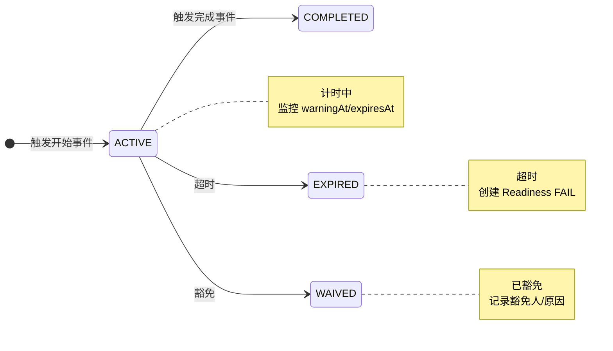

# 时间规则（Time Rules）

## 1. 概述
时间规则引擎用于监控 SMT 产线中各类时效性要求，如锡膏暴露时间、水洗时间等。系统通过事件驱动创建规则实例，并由 Cron Job 定时扫描状态变化。

> **注意**：时间规则目前仅适用于 SMT 产线，DIP 产线暂无时间规则应用场景。

## 2. 数据结构

### 2.1 TimeRuleDefinition（规则定义）
| 字段 | 类型 | 说明 |
|------|------|------|
| id | String | 唯一标识 |
| code | String | 规则代码（唯一） |
| name | String | 规则名称 |
| description | String? | 描述 |
| ruleType | Enum | 规则类型 |
| durationMinutes | Int | 时限（分钟） |
| warningMinutes | Int? | 预警时间（提前多少分钟） |
| startEvent | String | 触发开始的事件 |
| endEvent | String | 触发完成的事件 |
| scope | Enum | 作用域（GLOBAL/LINE/ROUTE/PRODUCT） |
| scopeValue | String? | 作用域值（具体 ID） |
| requiresWashStep | Boolean | 是否需要水洗工序才生效 |
| isWaivable | Boolean | 是否可豁免 |
| isActive | Boolean | 是否启用 |
| priority | Int | 优先级（冲突时选择） |

### 2.2 TimeRuleInstance（规则实例）
| 字段 | 类型 | 说明 |
|------|------|------|
| id | String | 唯一标识 |
| definitionId | String | 关联的规则定义 |
| runId | String? | 关联的 Run |
| activeKey | String? | 幂等/单活 key |
| entityType | String | 实体类型（如 SOLDER_PASTE_LOT） |
| entityId | String | 实体 ID |
| entityDisplay | String? | 显示名称 |
| startedAt | DateTime | 计时开始时间 |
| expiresAt | DateTime | 过期时间 |
| warningAt | DateTime? | 预警时间 |
| status | Enum | 状态 |
| completedAt | DateTime? | 完成时间 |
| expiredAt | DateTime? | 超时时间 |
| waivedAt | DateTime? | 豁免时间 |
| waivedBy | String? | 豁免人 |
| waiveReason | String? | 豁免原因 |
| readinessItemId | String? | 关联的就绪检查项 |
| warningNotified | Boolean | 是否已发送预警通知 |
| expiryNotified | Boolean | 是否已发送超时通知 |

## 3. 规则类型

### 3.1 锡膏暴露规则（SOLDER_PASTE_EXPOSURE）
| 属性 | 值 |
|------|-----|
| 规则代码 | `SOLDER_PASTE_24H` |
| 时限 | 24 小时（1440 分钟） |
| 预警时间 | 2 小时（120 分钟） |
| 触发事件 | 锡膏开封（PASTE_ISSUED） |
| 完成事件 | 锡膏消耗完毕（PASTE_CONSUMED） |
| 作用域 | 全局 |

**业务逻辑**：
- 锡膏开封后开始计时
- 超过 24 小时未使用完的锡膏需报废或豁免
- 超时会创建 Readiness 检查项 FAIL

### 3.2 水洗时间规则（POST_REFLOW_WASH）
| 属性 | 值 |
|------|-----|
| 规则代码 | `POST_REFLOW_WASH_4H` |
| 时限 | 4 小时（240 分钟） |
| 预警时间 | 30 分钟 |
| 触发事件 | 回流焊完成（REFLOW_OUT） |
| 完成事件 | 水洗完成（WASH_COMPLETE） |
| 作用域 | 路由级别 |
| 前提条件 | 路由包含水洗工序 |

**业务逻辑**：
- 仅当路由配置了水洗工序时生效（`requiresWashStep=true`）
- 回流焊 TrackOut 后开始计时
- 超过 4 小时未进行水洗的板需特殊处理

## 4. 规则状态流转



### 4.1 状态说明
| 状态 | 说明 |
|------|------|
| ACTIVE | 计时中，等待完成或超时 |
| COMPLETED | 正常完成（在时限内触发完成事件） |
| EXPIRED | 超时（未在时限内完成） |
| WAIVED | 已豁免（由授权人员豁免） |

## 5. 触发与监控

### 5.1 事件驱动创建
规则实例通过事件驱动创建：

```
事件发生（如锡膏开封）
    ↓
EventProcessor 处理
    ↓
匹配 TimeRuleDefinition（startEvent）
    ↓
创建 TimeRuleInstance
    - startedAt = 当前时间
    - expiresAt = startedAt + durationMinutes
    - warningAt = expiresAt - warningMinutes
```

### 5.2 Cron Job 监控
系统通过 Cron Job 定时扫描规则实例：

```
每分钟执行：
1. 查询 status=ACTIVE 的实例
2. 检查 warningAt：若到期且未通知 → 发送预警
3. 检查 expiresAt：若到期 → 标记 EXPIRED，创建 Readiness FAIL
```

### 5.3 事件驱动完成
```
事件发生（如锡膏消耗完毕）
    ↓
EventProcessor 处理
    ↓
匹配 TimeRuleInstance（entityType + entityId + status=ACTIVE）
    ↓
更新 status=COMPLETED, completedAt=当前时间
```

## 6. 通知与告警

### 6.1 预警通知
- 触发时机：`warningAt` 到期
- 通知方式：系统通知 + 看板提醒
- 通知对象：线长、操作员

### 6.2 超时告警
- 触发时机：`expiresAt` 到期
- 通知方式：系统通知 + 邮件 + 看板
- 通知对象：线长、质量工程师、厂长

### 6.3 通知内容
```
【SMT 时间规则预警】
规则：锡膏暴露时间限制
实体：锡膏批次 PASTE-2026-001
开始时间：2026-01-27 08:00
预警时间：2026-01-28 06:00
到期时间：2026-01-28 08:00
请及时处理！
```

## 7. 豁免机制

### 7.1 豁免权限
| 权限 | 说明 | 典型角色 |
|------|------|----------|
| `readiness:override` | 豁免时间规则 | 具备 readiness:override 权限的角色 |

### 7.2 豁免 API
```
POST /api/time-rules/:instanceId/waive

Request:
{
  "reason": "紧急生产需求，锡膏质量已确认正常"
}

Response:
{
  "id": "instance-id",
  "status": "WAIVED",
  "waivedBy": "user-id",
  "waivedAt": "2026-01-28T09:00:00Z",
  "waiveReason": "紧急生产需求，锡膏质量已确认正常"
}
```

### 7.3 豁免规则
- 只有 `isWaivable=true` 的规则可以豁免
- 豁免原因必填
- 豁免后关联的 Readiness 检查项也标记为 WAIVED

## 8. 与 Readiness 集成

### 8.1 TIME_RULE 检查项
当时间规则实例超时（EXPIRED）时，系统自动创建 Readiness 检查项：
- itemType: `TIME_RULE`
- itemKey: TimeRuleInstance.id
- status: `FAILED`
- failReason: "时间规则超时：{规则名称}"

### 8.2 门禁逻辑
- Run 授权前检查所有关联的 TIME_RULE 项
- 存在 FAILED 项时无法授权
- 豁免后状态变为 WAIVED，不再阻塞

## 9. 相关 API

| 操作 | API | 说明 |
|------|-----|------|
| 查询规则定义 | `GET /api/time-rules/definitions` | |
| 查询规则实例 | `GET /api/time-rules/instances` | 支持按状态/实体筛选 |
| 豁免实例 | `POST /api/time-rules/:instanceId/waive` | 需权限 |
| 手动完成 | `POST /api/time-rules/:instanceId/complete` | 特殊场景 |

## 10. 演示数据建议
- 创建锡膏暴露规则定义
- 创建 1 个 ACTIVE 状态实例（正常计时中）
- 创建 1 个接近预警时间的实例
- 创建 1 个 EXPIRED 状态实例（超时场景）
- 创建 1 个 WAIVED 状态实例（豁免场景）
