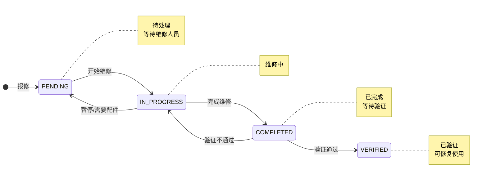

# 维修管理（Maintenance）

## 1. 概述
维修管理模块用于记录和跟踪设备、夹具、钢网等实体的维修过程，确保维修记录可追溯，并与 Readiness 检查联动。

## 2. 数据结构

### 2.1 MaintenanceRecord（维修记录）
| 字段 | 类型 | 说明 |
|------|------|------|
| id | String | 唯一标识 |
| lineId | String? | 关联产线 |
| entityType | Enum | 实体类型 |
| entityId | String | 实体 ID |
| entityDisplay | String? | 实体显示名称 |
| maintenanceType | Enum | 维修类型 |
| status | Enum | 维修状态 |
| description | String | 问题描述 |
| resolution | String? | 解决方案 |
| partsReplaced | String? | 更换部件 |
| cost | Float? | 维修成本 |
| reportedAt | DateTime | 报修时间 |
| startedAt | DateTime? | 开始维修时间 |
| completedAt | DateTime? | 完成时间 |
| reportedBy | String | 报修人 |
| assignedTo | String? | 指派维修人员 |
| completedBy | String? | 完成维修人员 |

## 3. 维修实体类型

### 3.1 SMT 产线适用实体
| 实体类型 | 说明 | 典型场景 |
|----------|------|----------|
| FIXTURE | 夹具 | 载板夹具磨损、变形 |
| STENCIL | 钢网 | 钢网堵孔、变形、张力不足 |
| SQUEEGEE | 刮刀 | 刮刀磨损、刀口损坏 |
| EQUIPMENT | 设备 | 贴片机、回流焊设备故障 |

### 3.2 实体类型详情
```typescript
enum MaintenanceEntityType {
  FIXTURE     // 夹具
  STENCIL     // 钢网
  SQUEEGEE    // 刮刀
  EQUIPMENT   // 设备
}
```

## 4. 维修类型

| 维修类型 | 说明 |
|----------|------|
| REPAIR | 维修（修复故障） |
| PREVENTIVE | 预防性维护 |
| CALIBRATION | 校准 |
| CLEANING | 清洗 |
| REPLACEMENT | 更换 |

```typescript
enum MaintenanceType {
  REPAIR       // 维修
  PREVENTIVE   // 预防性维护
  CALIBRATION  // 校准
  CLEANING     // 清洗
  REPLACEMENT  // 更换
}
```

## 5. 维修状态流转



### 5.1 状态说明
| 状态 | 说明 |
|------|------|
| PENDING | 待处理（已报修，等待处理） |
| IN_PROGRESS | 维修中 |
| COMPLETED | 已完成（等待验证） |
| VERIFIED | 已验证（可恢复使用） |
| CANCELLED | 已取消 |

## 6. 维修流程

### 6.1 完整流程
```
1. 报修
   - 操作员发现问题，创建维修记录
   - 记录问题描述、实体信息
   - 状态：PENDING

2. 指派
   - 线长/维修主管指派维修人员
   - 设置 assignedTo

3. 开始维修
   - 维修人员确认接单
   - 状态：IN_PROGRESS
   - 记录 startedAt

4. 完成维修
   - 记录 resolution（解决方案）
   - 记录 partsReplaced（更换部件）
   - 状态：COMPLETED
   - 记录 completedAt, completedBy

5. 验证
   - 质量人员验证维修效果
   - 状态：VERIFIED
   - 实体可恢复使用

6. 恢复使用
   - 更新实体状态（如夹具状态改为 AVAILABLE）
   - Readiness 检查可通过
```

### 6.2 API 操作

#### 创建维修记录
```
POST /api/maintenance-records

Request:
{
  "entityType": "STENCIL",
  "entityId": "stencil-001",
  "entityDisplay": "钢网-A1-001",
  "maintenanceType": "REPAIR",
  "description": "钢网堵孔严重，需清洗"
}
```

#### 开始维修
```
POST /api/maintenance-records/:id/start

Request:
{
  "assignedTo": "维修员-001"
}
```

#### 完成维修
```
POST /api/maintenance-records/:id/complete

Request:
{
  "resolution": "超声波清洗后恢复正常",
  "partsReplaced": "无",
  "cost": 50
}
```

#### 验证维修
```
POST /api/maintenance-records/:id/verify

Request:
{
  "remark": "已验证，钢网张力和透锡率正常"
}
```

## 7. 与 Readiness 的联动

### 7.1 维修中实体的 Readiness 检查
当实体处于维修状态（有 PENDING/IN_PROGRESS 的维修记录）时：
- 相关 Readiness 检查项 FAIL
- 例如：钢网在维修 → STENCIL 检查项 FAIL

### 7.2 维修完成后的 Readiness 恢复
维修验证通过后（VERIFIED）：
- 实体状态恢复正常
- 重新执行 Readiness 检查可通过

### 7.3 Readiness 检查逻辑
```
检查 PREP_FIXTURE / PREP_STENCIL_USAGE 时：
1. 查询实体是否有未完成的维修记录
2. 若存在 → FAIL，原因："实体正在维修中"
3. 若不存在 → 继续其他检查
```

## 8. 页面入口

| 页面 | 路径 | 说明 |
|------|------|------|
| 维修记录列表 | `/mes/maintenance-records` | 查看所有维修记录 |
| 创建维修记录 | `/mes/maintenance-records/new` | 报修入口 |
| 维修详情 | `/mes/maintenance-records/:id` | 查看/更新维修状态 |

## 9. 相关 API

| 操作 | API | 说明 |
|------|-----|------|
| 查询维修记录 | `GET /api/maintenance-records` | 支持按状态/实体筛选 |
| 创建维修记录 | `POST /api/maintenance-records` | 报修 |
| 开始维修 | `POST /api/maintenance-records/:id/start` | |
| 完成维修 | `POST /api/maintenance-records/:id/complete` | |
| 验证维修 | `POST /api/maintenance-records/:id/verify` | |
| 取消维修 | `POST /api/maintenance-records/:id/cancel` | |

## 10. 演示数据建议
- 创建 1 个 PENDING 状态的钢网维修记录
- 创建 1 个 IN_PROGRESS 状态的夹具维修记录
- 创建 1 个 VERIFIED 状态的刮刀维修记录（已完成）
- 创建 1 个设备维修记录（REPAIR 类型）
