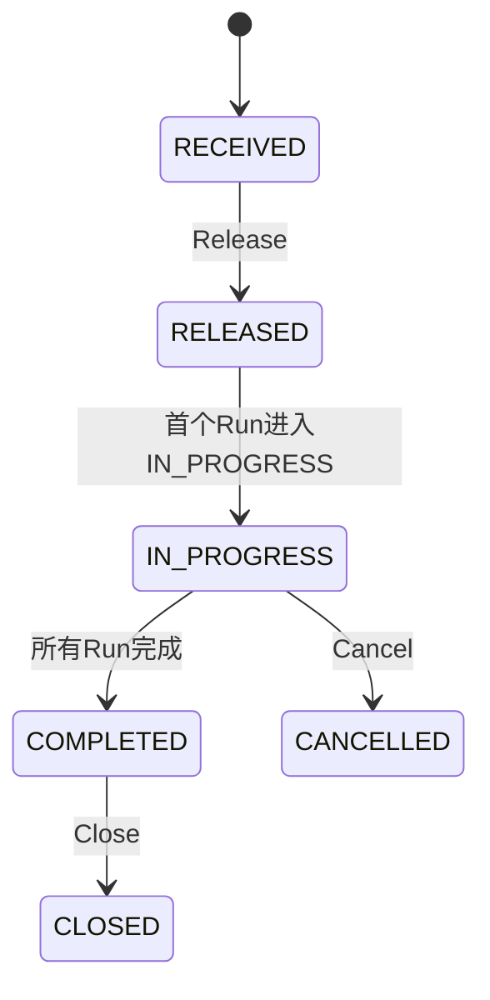
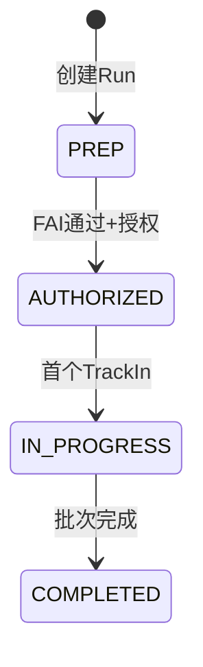
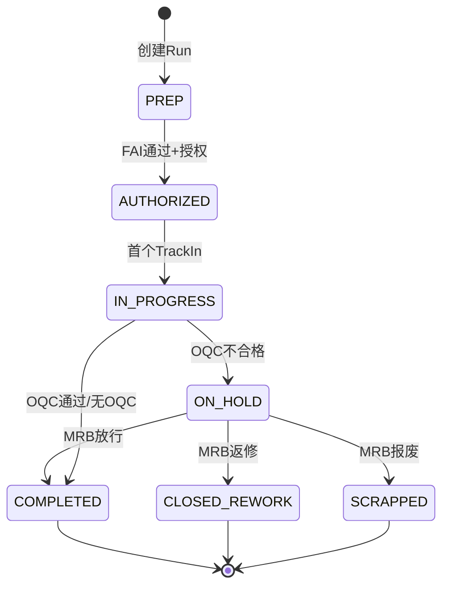
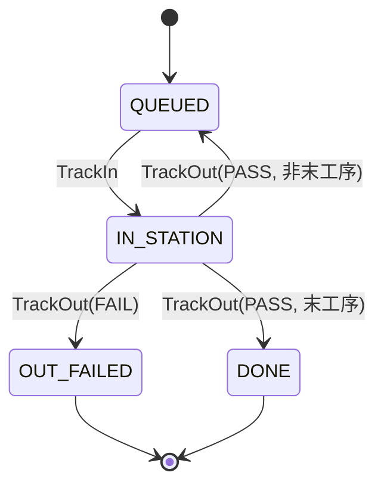
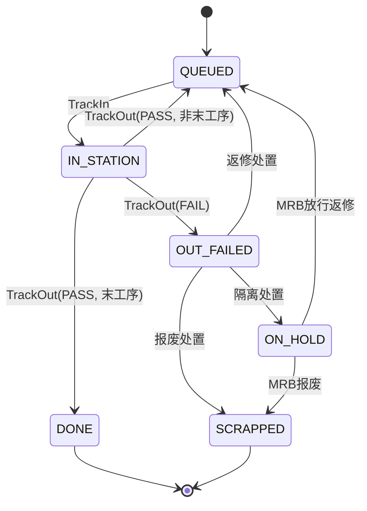

# State Machines Design

> **更新时间**: 2025-01-03
> **实现状态**: 基础状态机已实现，扩展状态 (HOLD/REWORK/SCRAP) 待 M2 完成
> **决策记录**: `conversation/smp_flow_design_decisions.md`

## 实现说明

- ✅ 工单状态机 (WorkOrderStatus): RECEIVED → RELEASED → IN_PROGRESS → COMPLETED → CLOSED / CANCELLED
- ✅ 批次状态机 (RunStatus): PREP → AUTHORIZED → IN_PROGRESS → COMPLETED
- ⬜ 批次扩展状态 (M2): ON_HOLD, CLOSED_REWORK, SCRAPPED
- ✅ 单件状态机 (UnitStatus): QUEUED → IN_STATION → DONE / OUT_FAILED
- ⬜ 单件扩展状态 (M2): ON_HOLD, SCRAPPED

---

## 1. 工单状态机 (WorkOrderStatus) - M1 ✅



| 状态 | 触发条件 | API |
|------|---------|-----|
| RECEIVED | ERP 同步 | `POST /api/integration/work-orders` |
| RELEASED | 手动释放 | `POST /api/work-orders/{woNo}/release` |
| IN_PROGRESS | 首个 Run 进入 IN_PROGRESS | (自动触发) |
| COMPLETED | 所有 Run 完成 | (自动触发) |
| CLOSED | 归档 | `POST /api/work-orders/{woNo}/close` |
| CANCELLED | 取消 | `POST /api/work-orders/{woNo}/cancel` |

---

## 2. 批次状态机 (RunStatus)

### M1 基础状态 ✅



### M2 扩展状态 ⬜



| 状态 | 语义 | 触发条件 | 里程碑 |
|------|------|---------|--------|
| PREP | 准备中 | 创建 Run | M1 ✅ |
| AUTHORIZED | 已授权 | FAI 通过 + 授权 | M1 ✅ |
| IN_PROGRESS | 执行中 | 首个 TrackIn | M1 ✅ |
| ON_HOLD | OQC隔离 | OQC 不合格 | M2 ⬜ |
| COMPLETED | 成功完成 | OQC 通过 或 MRB 放行 | M1 ✅ |
| CLOSED_REWORK | 闭环返修 | MRB 决策返修 | M2 ⬜ |
| SCRAPPED | 报废 | MRB 决策报废 | M2 ⬜ |

**状态语义说明**：
- `COMPLETED`: 生产成功完成，无质量问题或已放行
- `CLOSED_REWORK`: 生产流程结束，但因 OQC 不合格已创建返修批次
- `SCRAPPED`: 整批报废

**MRB 返修时原 Run 状态变化**：
```
原 Run: IN_PROGRESS → ON_HOLD (OQC失败) → CLOSED_REWORK (MRB返修)
返修 Run: PREP 或 AUTHORIZED (取决于返修类型)
```

---

## 3. 单件状态机 (UnitStatus)

### M1 基础状态 ✅



### M2 扩展状态 ⬜



| 状态 | 触发条件 | 里程碑 |
|------|---------|--------|
| QUEUED | 初始/等待下工序 | M1 ✅ |
| IN_STATION | TrackIn | M1 ✅ |
| DONE | TrackOut(PASS, 末工序) | M1 ✅ |
| OUT_FAILED | TrackOut(FAIL) | M1 ✅ |
| ON_HOLD | 隔离处置 | M2 ⬜ |
| SCRAPPED | 报废处置 | M2 ⬜ |

---

## 4. MRB 返修流程状态变化

当 OQC 不合格触发 MRB 评审，决策返修时：

```
┌─────────────────────────────────────────────────────────────┐
│ 原批次 (Run A)                                               │
│   IN_PROGRESS → ON_HOLD → CLOSED_REWORK                     │
│                                                              │
│ 返修批次 (Run A-RW1)                                         │
│   ┌─ 复用就绪 → AUTHORIZED (MRB授权, 可豁免FAI)              │
│   └─ 重新检查 → PREP (需重新FAI)                             │
└─────────────────────────────────────────────────────────────┘
```

**MRB FAI 豁免规则**：
- 常规授权：必须 FAI PASS
- MRB 授权（返修 Run）：可豁免 FAI，但必须记录 `mrbFaiWaiver` + `mrbWaiverReason`
- 豁免权限仅限 MRB 角色

---

## 参考文档

- SMP 流程图: `03_smp_flows_v2.md`
- 端到端流程: `01_end_to_end_flows.md`
- 决策记录: `conversation/smp_flow_design_decisions.md`
