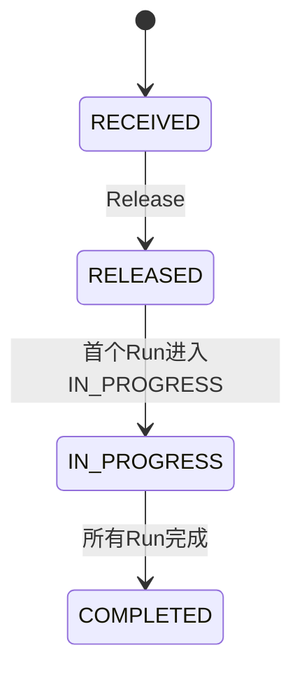
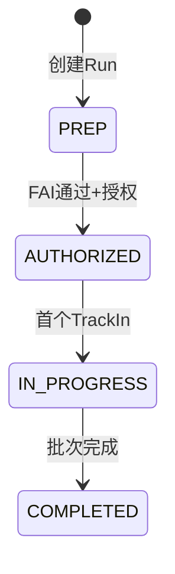
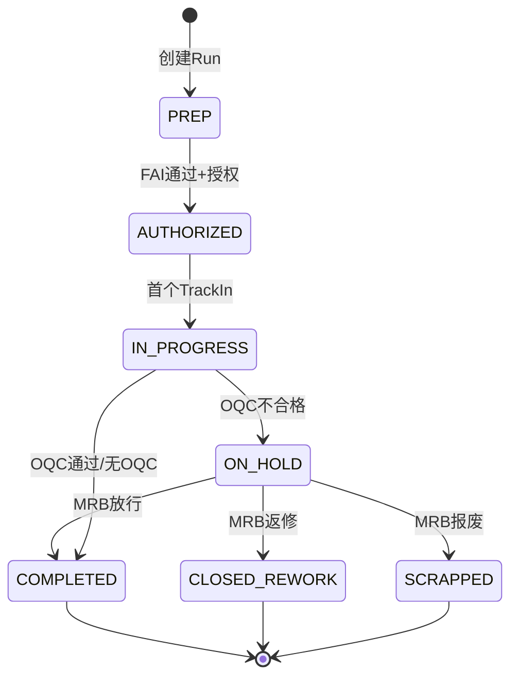
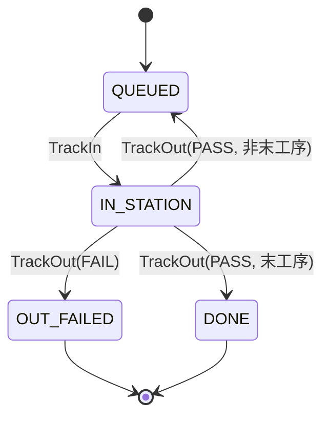
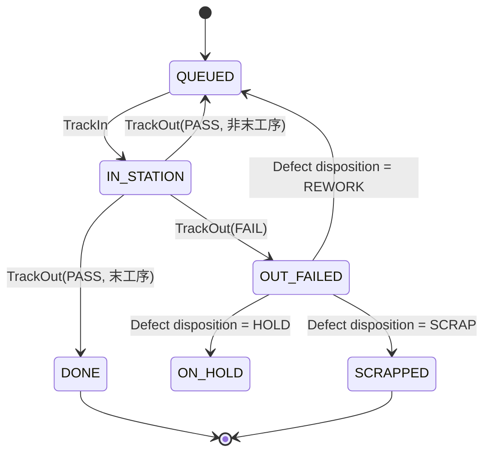

# State Machines Design

> **更新时间**: 2026-01-06
> **实现状态**: Run/Unit/WO 状态机已与当前代码实现对齐（含 M2: OQC/MRB/返修 Run/单件 HOLD/SCRAP）
> **参考**: `domain_docs/mes/spec/process/03_smp_flows.md`（关键设计决策）

## 实现说明

- ✅ 工单状态机 (WorkOrderStatus): RECEIVED → RELEASED → IN_PROGRESS → COMPLETED
- ✅ 批次状态机 (RunStatus): PREP → AUTHORIZED → IN_PROGRESS → COMPLETED
- ✅ 批次扩展状态 (M2): ON_HOLD, CLOSED_REWORK, SCRAPPED
- ✅ 单件状态机 (UnitStatus): QUEUED → IN_STATION → DONE / OUT_FAILED
- ✅ 单件扩展状态 (M2): ON_HOLD, SCRAPPED

---

## 1. 工单状态机 (WorkOrderStatus) - M1 ✅



| 状态 | 触发条件 | API |
|------|---------|-----|
| RECEIVED | ERP 同步 | `POST /api/integration/work-orders` |
| RELEASED | 手动释放 | `POST /api/work-orders/{woNo}/release` |
| IN_PROGRESS | 首个 Run 进入 IN_PROGRESS | (自动触发) |
| COMPLETED | 所有 Run 完成 | (自动触发) |

> **说明**：工单状态以 SMP 主流程为准，无额外状态分支。

---

## 2. 批次状态机 (RunStatus)

### M1 基础状态 ✅



### M2 扩展状态 ✅



| 状态 | 语义 | 触发条件 | 里程碑 |
|------|------|---------|--------|
| PREP | 准备中 | 创建 Run | M1 ✅ |
| AUTHORIZED | 已授权 | FAI 通过 + 授权 | M1 ✅ |
| IN_PROGRESS | 执行中 | 首个 TrackIn | M1 ✅ |
| ON_HOLD | OQC隔离 | OQC 不合格 | M2 ✅ |
| COMPLETED | 成功完成 | OQC 通过 或 MRB 放行 | M1 ✅ |
| CLOSED_REWORK | 闭环返修 | MRB 决策返修 | M2 ✅ |
| SCRAPPED | 报废 | MRB 决策报废 | M2 ✅ |

**状态语义说明**：
- `COMPLETED`: 生产成功完成，无质量问题或已放行
- `CLOSED_REWORK`: 生产流程结束，但因 OQC 不合格已创建返修批次
- `SCRAPPED`: 整批报废

**MRB 返修时原 Run 状态变化**：
```
原 Run: IN_PROGRESS → ON_HOLD (OQC失败) → CLOSED_REWORK (MRB返修)
返修 Run: PREP 或 AUTHORIZED (取决于返修类型)
```

---

## 3. 单件状态机 (UnitStatus)

### M1 基础状态 ✅



### M2 扩展状态 ✅



| 状态 | 触发条件 | 里程碑 |
|------|---------|--------|
| QUEUED | 初始/等待下工序 | M1 ✅ |
| IN_STATION | TrackIn | M1 ✅ |
| DONE | TrackOut(PASS, 末工序) | M1 ✅ |
| OUT_FAILED | TrackOut(FAIL) | M1 ✅ |
| ON_HOLD | 隔离处置（Defect disposition=HOLD） | M2 ✅ |
| SCRAPPED | 报废处置（Defect disposition=SCRAP） | M2 ✅ |

---

## 4. MRB 返修流程状态变化

当 OQC 不合格触发 MRB 评审，决策返修时：

```
┌─────────────────────────────────────────────────────────────┐
│ 原批次 (Run A)                                               │
│   IN_PROGRESS → ON_HOLD → CLOSED_REWORK                     │
│                                                              │
│ 返修批次 (Run A-RW1)                                         │
│   ┌─ 复用就绪 → AUTHORIZED (MRB授权, 可豁免FAI)              │
│   └─ 重新检查 → PREP (需重新FAI)                             │
└─────────────────────────────────────────────────────────────┘
```

**MRB FAI 豁免规则**：
- 常规授权：必须 FAI PASS
- MRB 授权（返修 Run）：可豁免 FAI，但必须记录 `mrbFaiWaiver` + `mrbWaiverReason`
- 豁免权限仅限具备 `QUALITY_DISPOSITION` 权限的角色

---

## 5. 规范与历史实现映射（数据迁移参考）

> 本仓库按“绿地实现”推进，不承诺/不维护旧系统枚举迁移表；如未来需要迁移支持，请单独在迁移文档中维护。

---

## 参考文档

- SMP 流程图: `03_smp_flows.md`
- DIP 流程图: `04_dip_flows.md`
- 端到端流程: `01_end_to_end_flows.md`
- 关键决策: `03_smp_flows.md` → “关键设计决策”

---

## 6. 段首件 IPQC（规划）

当前系统只支持 **Run 级 FAI（一次）**（授权 gate）。DIP 的“后焊/测试首件”等段首件需求，建议按 IPQC 记录，不作为 Run 授权 gate：

- 复用 `Inspection`：
  - `Inspection.type = IPQC`
  - `Inspection.activeKey = ${runId}:IPQC:${stepNo}`（同一 Run 可多条 IPQC）
  - `Inspection.data` 存储 `{ stepNo, stepGroup, checkType, unitSn }`
- 与执行关系：
  - 通过 UI 提示或执行前置校验实现“软提示/软卡控”
  - 不改变 `Run.status`；不新增 Unit 状态

详见：`04_dip_flows.md` → “IPQC（段首件）实现方案（规划）”。
