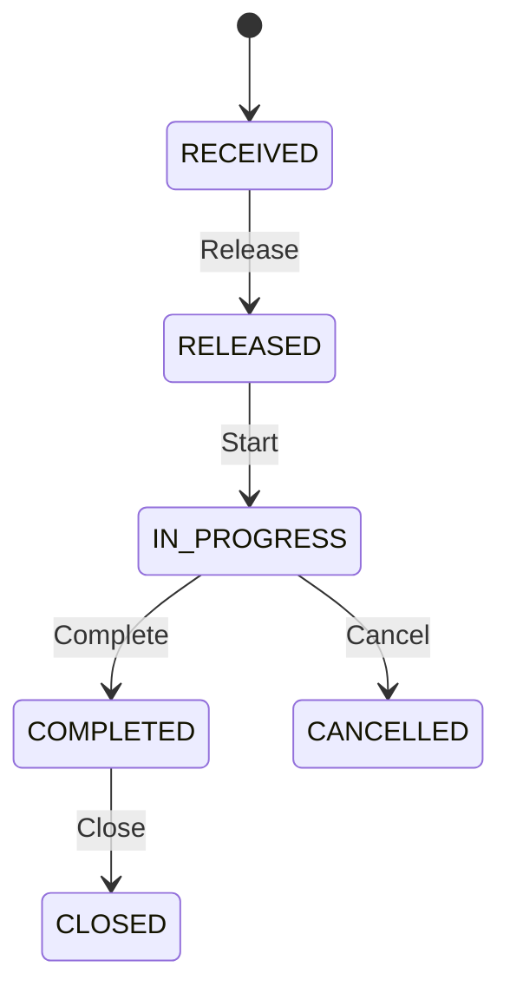
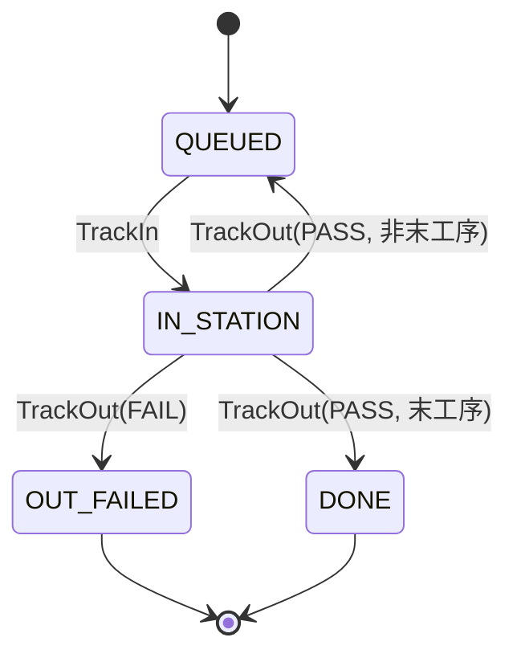

# State Machines Design

> **更新时间**: 2025-01-02
> **实现状态**: 基础状态机已实现，扩展状态 (HOLD/REWORK) 待 M2 完成

## 实现说明

- ✅ 工单状态机 (WorkOrderStatus): RECEIVED → RELEASED → IN_PROGRESS → COMPLETED → CLOSED / CANCELLED
- ✅ 批次状态机 (RunStatus): PREP → AUTHORIZED → IN_PROGRESS → COMPLETED → CLOSED
- ✅ 单件状态机 (UnitStatus): QUEUED → IN_STATION → DONE / OUT_FAILED
- ⬜ 扩展状态 (HOLD/REWORK/SCRAP): M2 待实现

---

## 1. 工单状态机 (Work Order State Machine)

## 2. 单件（Unit）状态机 (Unit State Machine)

> M1 简化：不包含 `OUT_PASSED`/返修/隔离等扩展状态；后续阶段再补齐。
