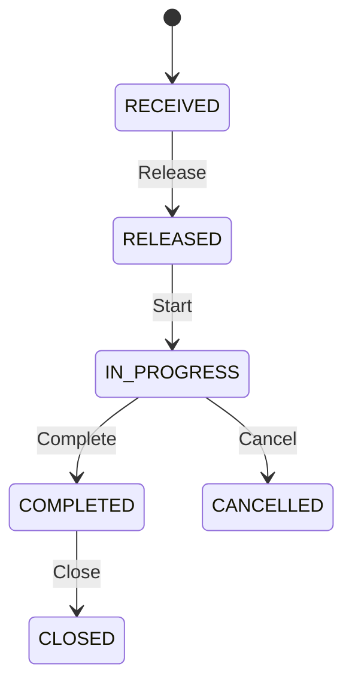
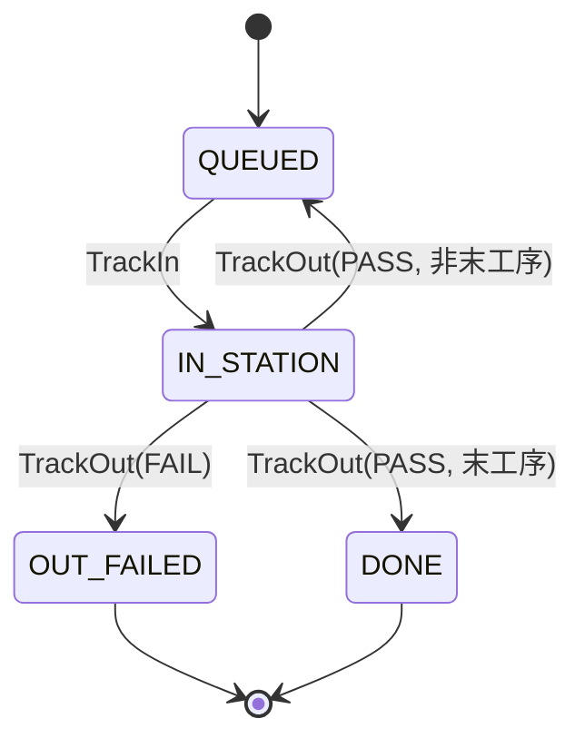

# State Machines Design

## 1. 工单状态机 (Work Order State Machine)

```mermaid
stateDiagram-v2
  [*] --> RECEIVED
  RECEIVED --> RELEASED: Release
  RELEASED --> IN_PROGRESS: Start
  IN_PROGRESS --> COMPLETED: Complete
  IN_PROGRESS --> CANCELLED: Cancel
  COMPLETED --> CLOSED: Close
```

## 2. 单件（Unit）状态机 (Unit State Machine)

```mermaid
stateDiagram-v2
  [*] --> QUEUED
  QUEUED --> IN_STATION: TrackIn
  IN_STATION --> OUT_FAILED: TrackOut(FAIL)
  IN_STATION --> QUEUED: TrackOut(PASS, 非末工序)
  IN_STATION --> DONE: TrackOut(PASS, 末工序)

  OUT_FAILED --> [*]
  DONE --> [*]
```

> M1 简化：不包含 `OUT_PASSED`/返修/隔离等扩展状态；后续阶段再补齐。
