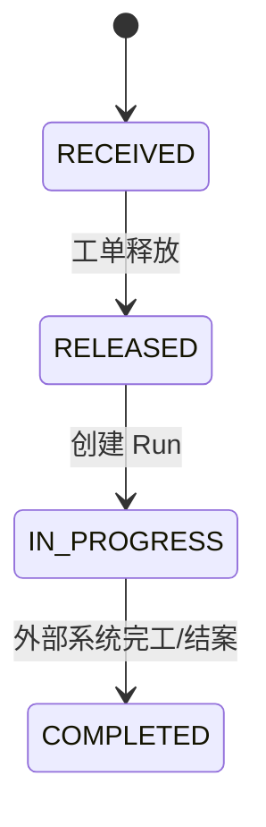
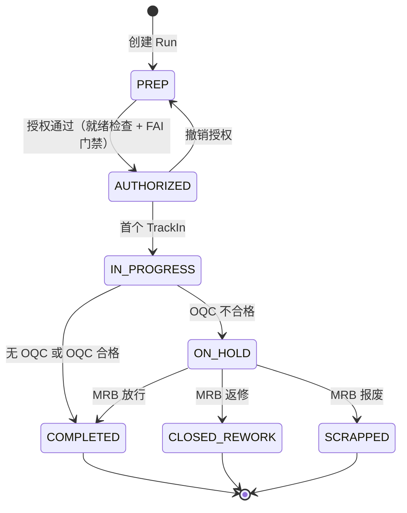
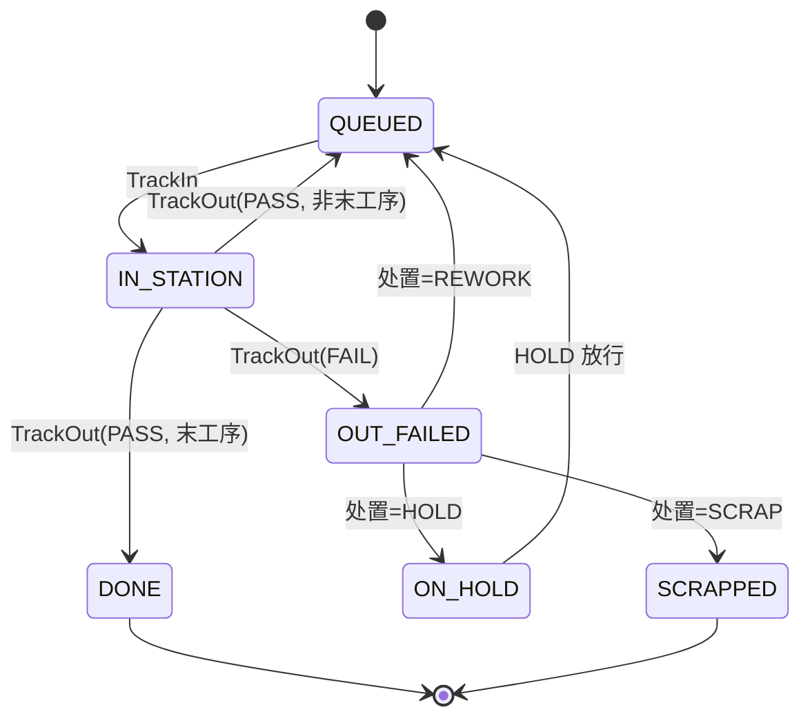

# 状态机定义

## 工单状态机（WorkOrderStatus）

| 状态 | 语义 | 触发点 |
|------|------|--------|
| `RECEIVED` | 已接收，未释放 | 工单接收（ERP/手动） |
| `RELEASED` | 已释放，可创建 Run | 工单释放 |
| `IN_PROGRESS` | 已开始执行 | 创建首个 Run（或 ERP 状态更新） |
| `COMPLETED` | 工单完工/结案 | ERP 状态更新（当前无 MES 内部 closeout） |

## 批次状态机（RunStatus）

| 状态 | 语义 | 触发点 |
|------|------|--------|
| `PREP` | 准备中 | 创建 Run |
| `AUTHORIZED` | 已授权 | 授权接口通过门禁 |
| `IN_PROGRESS` | 执行中 | 首个 TrackIn |
| `COMPLETED` | 成功完工 | OQC 不触发或 OQC 合格 |
| `ON_HOLD` | 隔离待评审 | OQC 不合格 |
| `CLOSED_REWORK` | 原 Run 关闭并进入返修闭环 | MRB 决策返修（同时创建返修 Run） |
| `SCRAPPED` | 原 Run 整批报废 | MRB 决策报废 |

## 单件状态机（UnitStatus）

| 状态 | 语义 | 触发点 |
|------|------|--------|
| `QUEUED` | 等待加工/待下一工序 | 初始状态、PASS 推进、返修/放行回流 |
| `IN_STATION` | 已进站加工中 | TrackIn |
| `OUT_FAILED` | 出站失败待处置 | TrackOut(FAIL) |
| `DONE` | 单件完成 | TrackOut(PASS, 末工序) |
| `ON_HOLD` | 单件隔离 | 不良处置=HOLD |
| `SCRAPPED` | 单件报废 | 不良处置=SCRAP |

说明：
- Unit 不引入 `REWORK` 状态；返修以 `ReworkTask` 表达，Unit 通过回退 `currentStepNo` 回到 `QUEUED`。
