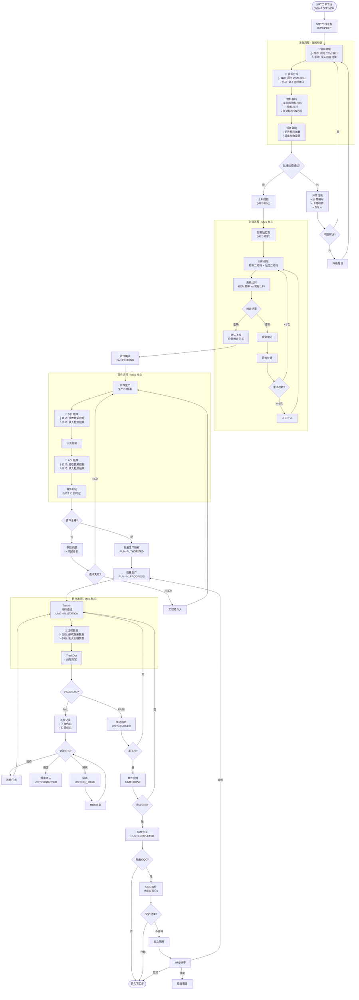

# SMT 产线执行流程 (SMP Flow v2)

> **版本**: v2.1 - MES 执行层 + 集成接口版
> **基于**: 03_smp_flows_userfeeback_draft.md
> **设计原则**: MES 专注执行层，外部系统通过集成接口对接，支持手动降级模式

---

## 架构定位

```
┌─────────────────────────────────────────────────────────────────┐
│                     MES 执行层 (本系统)                          │
│  ┌──────────────┐ ┌──────────────┐ ┌──────────────┐            │
│  │ 工单/批次    │ │ TrackIn/Out  │ │ 不良/处置    │            │
│  │ 状态管理     │ │ 执行追溯     │ │ 质量卡控     │            │
│  └──────────────┘ └──────────────┘ └──────────────┘            │
│  ┌──────────────┐ ┌──────────────┐ ┌──────────────┐            │
│  │ 就绪检查     │ │ 上料防错     │ │ OQC 抽检     │            │
│  │ (含集成卡控) │ │ (MES 核心)   │ │ (MES 核心)   │            │
│  └──────────────┘ └──────────────┘ └──────────────┘            │
└─────────────────────────────────────────────────────────────────┘
         ↑ 集成接口 (自动) / 手动录入 (降级模式) ↓
┌──────────────┐  ┌──────────────┐  ┌──────────────┐  ┌──────────┐
│  WMS/辅料    │  │  TPM/工装    │  │  SCADA/数采  │  │   BI     │
│  锡膏状态    │  │  钢网状态    │  │  SPI/AOI     │  │  OEE     │
│  (未来集成)  │  │  (未来集成)  │  │  (未来集成)  │  │ (未来)   │
└──────────────┘  └──────────────┘  └──────────────┘  └──────────┘
```

**设计原则**：
- MES 只关心 **"是否可用/是否合格"** 的结论
- 不关心外部系统如何得出结论
- 外部系统未就绪时，支持手动录入作为降级模式

---

## 主流程图



---

## 集成接口规范

### 接口设计原则

1. **统一输入格式**：不管自动还是手动，MES 接收的数据结构一致
2. **来源标识**：记录数据来源（AUTO/MANUAL）用于审计
3. **手动降级**：外部系统不可用时，允许人工录入

### 接口定义

#### 1. 钢网就绪状态 (TPM → MES)

```typescript
// POST /mes/integration/stencil-status
interface StencilStatusInput {
  stencilId: string           // 钢网编号
  version: string             // 版本号
  status: 'READY' | 'NOT_READY' | 'MAINTENANCE'
  tensionValue?: number       // 张力值 (可选，用于记录)
  lastCleanedAt?: string      // 最后清洗时间
  source: 'AUTO' | 'MANUAL'   // 数据来源
  operatorId?: string         // 手动录入时的操作员
}

// MES 只关心: status === 'READY' 才允许开工
```

#### 2. 锡膏合规状态 (WMS → MES)

```typescript
// POST /mes/integration/solder-paste-status
interface SolderPasteStatusInput {
  lotId: string               // 锡膏批次号
  status: 'COMPLIANT' | 'NON_COMPLIANT' | 'EXPIRED'
  expiresAt?: string          // 有效期
  thawedAt?: string           // 回温开始时间 (可选记录)
  stirredAt?: string          // 搅拌时间 (可选记录)
  source: 'AUTO' | 'MANUAL'
  operatorId?: string
}

// MES 只关心: status === 'COMPLIANT' 才允许使用
```

#### 3. SPI/AOI 检测结果 (SCADA → MES)

```typescript
// POST /mes/integration/inspection-result
interface InspectionResultInput {
  unitSn: string              // 单件序列号
  inspectionType: 'SPI' | 'AOI' | 'XRAY' | 'OTHER'
  result: 'PASS' | 'FAIL'
  defects?: Array<{
    code: string              // 不良代码
    location: string          // 位置 (如 R1, C5)
    description?: string
  }>
  rawData?: Record<string, unknown>  // 原始数据 (可选存档)
  source: 'AUTO' | 'MANUAL'
  equipmentId?: string        // 设备ID
  operatorId?: string
}

// MES 消费:
// - PASS → 继续流程
// - FAIL → 创建 Defect 记录，触发处置流程
```

#### 4. 设备 OEE 数据 (SCADA → BI，MES 不处理)

```typescript
// 这个接口 MES 不实现，由 BI 系统消费
// 仅作为规范定义，供未来系统参考
interface OeeDataInput {
  equipmentId: string
  timestamp: string
  availability: number        // 0-1
  performance: number         // 0-1
  quality: number             // 0-1
  throwRate?: number          // 抛料率
}
```

---

## 手动降级模式

当外部系统未就绪时，MES 提供手动录入界面：

### 就绪检查 - 手动确认

| 检查项 | 手动录入字段 | 卡控逻辑 |
|--------|-------------|----------|
| 钢网就绪 | 钢网编号 + 确认状态 | 状态 = READY 才放行 |
| 锡膏合规 | 批次号 + 确认状态 | 状态 = COMPLIANT 才放行 |
| 设备就绪 | 设备ID + 确认状态 | 状态 = READY 才放行 |

### 过程数据 - 手动录入

| 数据点 | 手动录入方式 | 说明 |
|--------|-------------|------|
| SPI 结果 | 选择 PASS/FAIL + 不良代码 | 简化版，不含 SPC 数据 |
| AOI 结果 | 选择 PASS/FAIL + 不良代码 | 简化版，不含图片 |
| 温度曲线 | 确认"曲线正常"复选框 | 仅做确认，不采集数值 |

### 审计追溯

所有手动录入记录都会标记 `source: 'MANUAL'`，便于：
- 区分自动采集 vs 人工录入
- 统计手动录入占比（衡量自动化程度）
- 追溯责任人

---

## MES 核心模块 vs 集成模块

| 模块 | 归属 | MES 实现内容 |
|------|------|-------------|
| **工单管理** | MES 核心 | 状态机、ERP 同步 |
| **批次管理** | MES 核心 | Run 状态、授权 |
| **就绪检查** | MES 核心 | 检查项配置、卡控逻辑、集成接口 |
| **上料防错** | MES 核心 | 站位表、BOM 比对、绑定记录 |
| **TrackIn/Out** | MES 核心 | 进出站、状态流转 |
| **不良/处置** | MES 核心 | 缺陷记录、REWORK/SCRAP/HOLD |
| **OQC 抽检** | MES 核心 | 抽样规则、检验记录 |
| **钢网管理** | 🔌 集成 | 接收状态，不管理生命周期 |
| **锡膏管理** | 🔌 集成 | 接收状态，不管理生命周期 |
| **SPI/AOI** | 🔌 集成 | 接收结果，不直连设备 |
| **OEE/抛料率** | ❌ 不实现 | 由 BI 系统负责 |

---

## 状态机对照

### 工单状态 (WorkOrderStatus)

| 流程节点 | 状态值 |
|---------|--------|
| SMT工单下达 | `RECEIVED` |
| 批量生产授权后 | `RELEASED` → `IN_PROGRESS` |
| SMT完工处理 | `COMPLETED` |

### 批次状态 (RunStatus)

| 流程节点 | 状态值 |
|---------|--------|
| SMT产线准备 | `PREP` |
| 批量生产授权 | `AUTHORIZED` |
| 批量生产 | `IN_PROGRESS` |
| SMT完工 | `COMPLETED` |

### 单件状态 (UnitStatus)

| 流程节点 | 状态值 |
|---------|--------|
| TrackIn | `IN_STATION` |
| TrackOut(PASS, 非末工序) | `QUEUED` |
| TrackOut(PASS, 末工序) | `DONE` |
| TrackOut(FAIL) | `OUT_FAILED` |
| 隔离 | `ON_HOLD` |
| 报废 | `SCRAPPED` |

---

## API 清单

### MES 核心 API (已实现/待实现)

| API | 方法 | 状态 |
|-----|------|------|
| `/mes/work-orders/receive` | POST | ✅ 已实现 |
| `/mes/runs/readiness-check` | POST | ✅ 已实现 |
| `/mes/runs/:id/authorize` | PATCH | ✅ 已实现 |
| `/mes/execution/track-in` | POST | ✅ 已实现 |
| `/mes/execution/track-out` | POST | ✅ 已实现 |
| `/mes/defects` | POST | ✅ 已实现 |
| `/mes/defects/:id/disposition` | POST | ✅ 已实现 |
| `/mes/inspections` | POST | ✅ 已实现 |
| `/mes/oqc/samples` | POST | ⬜ 待实现 (M2) |
| `/mes/loading/verify` | POST | ⬜ 待实现 (上料防错) |

### 集成接口 API (待实现)

| API | 方法 | 用途 |
|-----|------|------|
| `/mes/integration/stencil-status` | POST | 接收钢网状态 |
| `/mes/integration/solder-paste-status` | POST | 接收锡膏状态 |
| `/mes/integration/inspection-result` | POST | 接收 SPI/AOI 结果 |

---

## 参考文档

- 原版草稿: `03_smp_flows_userfeeback_draft.md`
- MES 端到端流程: `01_end_to_end_flows.md`
- 状态机定义: `02_state_machines.md`
