# SMT 产线执行流程 (SMP Flow v2)

> **版本**: v2.2 - MES 执行层 + 集成接口版
> **基于**: 03_smp_flows_userfeeback_draft.md
> **设计原则**: MES 专注执行层，外部系统通过集成接口对接，支持手动降级模式
> **里程碑**: M1 已实现基础状态机，M2 扩展状态 (HOLD/REWORK/SCRAP) 规划中

---

## 变更日志

| 版本 | 变更内容 |
|------|----------|
| v2.2 | 修复 Review Findings: RUN 状态时序、API 路径、UNIT 状态标注、M1/M2 标记 |
| v2.1 | 增加集成接口规范、手动降级模式 |
| v2.0 | MES 系统对齐版 |

---

## 架构定位

```
┌─────────────────────────────────────────────────────────────────┐
│                     MES 执行层 (本系统)                          │
│  ┌──────────────┐ ┌──────────────┐ ┌──────────────┐            │
│  │ 工单/批次    │ │ TrackIn/Out  │ │ 不良/处置    │            │
│  │ 状态管理     │ │ 执行追溯     │ │ 质量卡控     │            │
│  └──────────────┘ └──────────────┘ └──────────────┘            │
│  ┌──────────────┐ ┌──────────────┐ ┌──────────────┐            │
│  │ 就绪检查     │ │ 上料防错     │ │ OQC 抽检     │            │
│  │ (含集成卡控) │ │ (MES 核心)   │ │ (MES 核心)   │            │
│  └──────────────┘ └──────────────┘ └──────────────┘            │
└─────────────────────────────────────────────────────────────────┘
         ↑ 集成接口 (自动) / 手动录入 (降级模式) ↓
┌──────────────┐  ┌──────────────┐  ┌──────────────┐  ┌──────────┐
│  WMS/辅料    │  │  TPM/工装    │  │  SCADA/数采  │  │   BI     │
│  锡膏状态    │  │  钢网状态    │  │  SPI/AOI     │  │  OEE     │
│  (未来集成)  │  │  (未来集成)  │  │  (未来集成)  │  │ (未来)   │
└──────────────┘  └──────────────┘  └──────────────┘  └──────────┘
```

**设计原则**：
- MES 只关心 **"是否可用/是否合格"** 的结论
- 不关心外部系统如何得出结论
- 外部系统未就绪时，支持手动录入作为降级模式

---

## 主流程图

```mermaid
flowchart TD
    Start(["ERP/APS 工单下达"]) --> WO_RCV["工单接收<br/>WO=RECEIVED"]
    WO_RCV --> WO_REL["工单释放<br/>WO=RELEASED"]
    WO_REL --> RUN_CREATE["创建批次<br/>冻结路由版本"]
    RUN_CREATE --> A["SMT产线准备<br/>RUN=PREP"]

    subgraph A_Sub [准备流程 - 就绪检查]
        direction TB
        A1["🔌 钢网就绪<br/>├ 自动: 调用 TPM 接口<br/>└ 手动: 录入检查结果"]
        A2["🔌 锡膏合规<br/>├ 自动: 调用 WMS 接口<br/>└ 手动: 录入合规确认"]
        A3["物料备料<br/>• 车间库物料扫码<br/>• 物料核对<br/>• 核对标签SN范围"]
        A4["设备就绪<br/>• 贴片程序加载<br/>• 设备参数设置"]

        A1 --> A2 --> A3 --> A4
    end

    A --> A1

    A4 --> P{就绪检查通过?}
    P -- 否 --> PEX["异常记录<br/>• 异常编号<br/>• 卡控项目<br/>• 责任人"]
    PEX --> PEXR{问题解决?}
    PEXR -- 是 --> A1
    PEXR -- 否 --> PESC["升级处理"]
    PESC --> A1
    P -- 是 --> B["上料防错<br/>(MES 核心)"]

    subgraph B_Sub [防错流程 - MES 核心]
        direction TB
        B1["加载站位表<br/>(MES 维护)"]
        B2["扫码验证<br/>物料二维码 + 站位二维码"]
        B3["系统比对<br/>BOM 物料 vs 实际上料"]
        B4{"验证结果"}
        B5["确认上料<br/>记录绑定关系"]
        B6["报警锁定"]
        B7["异常处理"]
        B8{重试次数?}
        B9["人工介入"]

        B1 --> B2 --> B3 --> B4
        B4 -- 正确 --> B5
        B4 -- 错误 --> B6
        B6 --> B7 --> B8
        B8 -- "<3次" --> B2
        B8 -- ">=3次" --> B9
        B9 --> B2
    end

    B --> B1
    B5 --> C["首件确认<br/>FAI=PENDING"]

    subgraph C_Sub [首件流程 - MES 核心]
        direction TB
        C1["首件生产<br/>生产2-3拼板"]
        C2["🔌 SPI 结果<br/>├ 自动: 接收数采数据<br/>└ 手动: 录入检测结果"]
        C3["回流焊接"]
        C4["🔌 AOI 结果<br/>├ 自动: 接收数采数据<br/>└ 手动: 录入检测结果"]
        C5["首件判定<br/>(MES 汇总判定)"]

        C1 --> C2 --> C3 --> C4 --> C5
    end

    C --> C1

    C5 --> D{"首件合格?"}
    D -->|否| F["参数调整<br/>• 原因记录"]
    F --> FC{连续失败?}
    FC -- "<3次" --> C1
    FC -- ">=3次" --> FE["工程师介入"]
    FE --> C1
    D -->|是| E["批量生产授权<br/>RUN=AUTHORIZED<br/>FAI=PASSED"]

    E --> WO_IP["工单开工<br/>WO=IN_PROGRESS"]
    WO_IP --> G["批量生产<br/>RUN=IN_PROGRESS"]

    subgraph G_Sub [执行追溯 - MES 核心]
        direction TB
        TI["TrackIn<br/>扫码进站<br/>UNIT=IN_STATION"]
        DC["🔌 过程数据<br/>├ 自动: 接收数采数据<br/>└ 手动: 录入关键参数"]
        TO["TrackOut<br/>出站判定"]

        TI --> DC --> TO
    end

    G --> TI

    TO --> RES{PASS/FAIL?}
    RES -- PASS --> LAST{末工序?}
    LAST -- 否 --> ADV["推进路由<br/>UNIT=QUEUED"]
    ADV --> TI
    LAST -- 是 --> DONEU["单件完成<br/>UNIT=DONE"]

    RES -- FAIL --> NG["不良记录<br/>UNIT=OUT_FAILED<br/>• 不良代码<br/>• 位置标记"]

    NG --> DISP{处置方式?}
    DISP -- "返修 [M2]" --> RW["返修任务<br/>UNIT → 返修工序"]
    RW --> TI
    DISP -- "报废 [M2]" --> SC["报废确认<br/>UNIT=SCRAPPED"]
    DISP -- "隔离 [M2]" --> HOLD["隔离<br/>UNIT=ON_HOLD"]
    HOLD --> MRB["MRB评审"] --> DISP

    DONEU --> I{"批次完成?"}
    I -->|否| TI
    I -->|是| OQC{触发OQC?}

    OQC -- 否 --> J["SMT完工<br/>RUN=COMPLETED"]
    OQC -- 是 --> OQCT["OQC抽检 [M2]<br/>(MES 核心)"]
    OQCT --> OQCR{OQC结果?}
    OQCR -- 合格 --> J
    OQCR -- 不合格 --> OQCH["批次隔离<br/>RUN=ON_HOLD [M2]"]
    OQCH --> OQCMRB["MRB评审"]
    OQCMRB -- 放行 --> J
    OQCMRB -- "返修(新Run)" --> RUN_RW["创建返修批次<br/>原RUN=COMPLETED"]
    RUN_RW --> G
    OQCMRB -- 报废 --> OQCSC["整批报废<br/>RUN=SCRAPPED [M2]"]

    J --> K(["转入下工序<br/>WO流转"])
```



---

## 关键设计决策

### 1. RUN 状态与 OQC 的关系

**问题**：原版 RUN=COMPLETED 在 OQC 之前，OQC 不合格返回批量生产会导致已完成的 Run 重新执行。

**解决方案**：
- OQC 在 RUN=COMPLETED 之前执行
- OQC 不合格 → RUN=ON_HOLD（隔离），而非直接返回执行
- MRB 评审后如需返修，创建 **新的返修 Run**，原 Run 标记为 COMPLETED
- 这保证了 Run 状态的不可逆性

```
批次完成? → OQC触发? → OQC结果?
                ↓ 合格      ↓ 不合格
            RUN=COMPLETED   RUN=ON_HOLD → MRB评审
                                            ↓ 返修
                                        创建新Run，原Run=COMPLETED
```

### 2. UNIT 状态标注

| 流程节点 | 状态变化 | 说明 |
|---------|---------|------|
| TrackIn | → `IN_STATION` | 进站 |
| TrackOut(PASS, 非末工序) | → `QUEUED` | 等待下工序 |
| TrackOut(PASS, 末工序) | → `DONE` | 直接完成，跳过 QUEUED |
| TrackOut(FAIL) | → `OUT_FAILED` | 等待处置 |
| 隔离处置 | → `ON_HOLD` [M2] | MRB 待评审 |
| 报废处置 | → `SCRAPPED` [M2] | 终态 |

### 3. M1/M2 功能边界

| 功能 | M1 状态 | M2 规划 |
|------|---------|---------|
| 基础 TrackIn/Out | ✅ 已实现 | - |
| UNIT: QUEUED/IN_STATION/DONE/OUT_FAILED | ✅ 已实现 | - |
| RUN: PREP/AUTHORIZED/IN_PROGRESS/COMPLETED | ✅ 已实现 | - |
| 不良登记 (Defect) | ✅ 已实现 | - |
| 处置判定 (Disposition) | ✅ 基础框架 | 完整返修流程 |
| UNIT: ON_HOLD/SCRAPPED | ⬜ | M2 实现 |
| RUN: ON_HOLD/SCRAPPED | ⬜ | M2 实现 |
| OQC 抽检 | ⬜ | M2 实现 |
| FAI 强制卡控 | ✅ 基础 | M2 完善 |

---

## 集成接口规范

### 接口设计原则

1. **统一输入格式**：不管自动还是手动，MES 接收的数据结构一致
2. **来源标识**：记录数据来源（AUTO/MANUAL）用于审计
3. **手动降级**：外部系统不可用时，允许人工录入

### 接口定义

#### 1. 钢网就绪状态 (TPM → MES)

```typescript
// POST /api/integration/stencil-status
interface StencilStatusInput {
  stencilId: string           // 钢网编号
  version: string             // 版本号
  status: 'READY' | 'NOT_READY' | 'MAINTENANCE'
  tensionValue?: number       // 张力值 (可选，用于记录)
  lastCleanedAt?: string      // 最后清洗时间
  source: 'AUTO' | 'MANUAL'   // 数据来源
  operatorId?: string         // 手动录入时的操作员
}

// MES 只关心: status === 'READY' 才允许开工
```

#### 2. 锡膏合规状态 (WMS → MES)

```typescript
// POST /api/integration/solder-paste-status
interface SolderPasteStatusInput {
  lotId: string               // 锡膏批次号
  status: 'COMPLIANT' | 'NON_COMPLIANT' | 'EXPIRED'
  expiresAt?: string          // 有效期
  thawedAt?: string           // 回温开始时间 (可选记录)
  stirredAt?: string          // 搅拌时间 (可选记录)
  source: 'AUTO' | 'MANUAL'
  operatorId?: string
}

// MES 只关心: status === 'COMPLIANT' 才允许使用
```

#### 3. SPI/AOI 检测结果 (SCADA → MES)

```typescript
// POST /api/integration/inspection-result
interface InspectionResultInput {
  unitSn: string              // 单件序列号
  inspectionType: 'SPI' | 'AOI' | 'XRAY' | 'OTHER'
  result: 'PASS' | 'FAIL'
  defects?: Array<{
    code: string              // 不良代码
    location: string          // 位置 (如 R1, C5)
    description?: string
  }>
  rawData?: Record<string, unknown>  // 原始数据 (可选存档)
  source: 'AUTO' | 'MANUAL'
  equipmentId?: string        // 设备ID
  operatorId?: string
}

// MES 消费:
// - PASS → 继续流程
// - FAIL → 创建 Defect 记录，触发处置流程
```

#### 4. 设备 OEE 数据 (SCADA → BI，MES 不处理)

```typescript
// 这个接口 MES 不实现，由 BI 系统消费
// 仅作为规范定义，供未来系统参考
interface OeeDataInput {
  equipmentId: string
  timestamp: string
  availability: number        // 0-1
  performance: number         // 0-1
  quality: number             // 0-1
  throwRate?: number          // 抛料率
}
```

---

## 手动降级模式

当外部系统未就绪时，MES 提供手动录入界面：

### 就绪检查 - 手动确认

| 检查项 | 手动录入字段 | 卡控逻辑 |
|--------|-------------|----------|
| 钢网就绪 | 钢网编号 + 确认状态 | 状态 = READY 才放行 |
| 锡膏合规 | 批次号 + 确认状态 | 状态 = COMPLIANT 才放行 |
| 设备就绪 | 设备ID + 确认状态 | 状态 = READY 才放行 |

### 过程数据 - 手动录入

| 数据点 | 手动录入方式 | 说明 |
|--------|-------------|------|
| SPI 结果 | 选择 PASS/FAIL + 不良代码 | 简化版，不含 SPC 数据 |
| AOI 结果 | 选择 PASS/FAIL + 不良代码 | 简化版，不含图片 |
| 温度曲线 | 确认"曲线正常"复选框 | 仅做确认，不采集数值 |

### 审计追溯

所有手动录入记录都会标记 `source: 'MANUAL'`，便于：
- 区分自动采集 vs 人工录入
- 统计手动录入占比（衡量自动化程度）
- 追溯责任人

---

## MES 核心模块 vs 集成模块

| 模块 | 归属 | MES 实现内容 |
|------|------|-------------|
| **工单管理** | MES 核心 | 状态机、ERP 同步 |
| **批次管理** | MES 核心 | Run 状态、授权 |
| **就绪检查** | MES 核心 | 检查项配置、卡控逻辑、集成接口 |
| **上料防错** | MES 核心 | 站位表、BOM 比对、绑定记录 |
| **TrackIn/Out** | MES 核心 | 进出站、状态流转 |
| **不良/处置** | MES 核心 | 缺陷记录、REWORK/SCRAP/HOLD |
| **OQC 抽检** | MES 核心 | 抽样规则、检验记录 |
| **钢网管理** | 🔌 集成 | 接收状态，不管理生命周期 |
| **锡膏管理** | 🔌 集成 | 接收状态，不管理生命周期 |
| **SPI/AOI** | 🔌 集成 | 接收结果，不直连设备 |
| **OEE/抛料率** | ❌ 不实现 | 由 BI 系统负责 |

---

## 状态机对照

### 工单状态 (WorkOrderStatus) - M1 ✅

| 流程节点 | 状态值 | API |
|---------|--------|-----|
| 工单接收 | `RECEIVED` | `POST /api/integration/work-orders` |
| 工单释放 | `RELEASED` | `POST /api/work-orders/{woNo}/release` |
| 批量授权后开工 | `IN_PROGRESS` | (Run 授权触发) |
| 完工 | `COMPLETED` | (所有 Run 完成) |

### 批次状态 (RunStatus)

| 流程节点 | 状态值 | 里程碑 | API |
|---------|--------|--------|-----|
| 创建批次 | `PREP` | M1 ✅ | `POST /api/work-orders/{woNo}/runs` |
| 批量授权 | `AUTHORIZED` | M1 ✅ | `POST /api/runs/{runNo}/authorizations` |
| 批量生产 | `IN_PROGRESS` | M1 ✅ | (首个 TrackIn 触发) |
| OQC 隔离 | `ON_HOLD` | M2 ⬜ | - |
| 完工 | `COMPLETED` | M1 ✅ | - |
| 报废 | `SCRAPPED` | M2 ⬜ | - |

### 单件状态 (UnitStatus)

| 流程节点 | 状态值 | 里程碑 |
|---------|--------|--------|
| TrackIn | `IN_STATION` | M1 ✅ |
| TrackOut(PASS, 非末工序) | `QUEUED` | M1 ✅ |
| TrackOut(PASS, 末工序) | `DONE` | M1 ✅ |
| TrackOut(FAIL) | `OUT_FAILED` | M1 ✅ |
| 隔离 | `ON_HOLD` | M2 ⬜ |
| 报废 | `SCRAPPED` | M2 ⬜ |

---

## API 清单

### MES 核心 API

| API | 方法 | 功能 | 状态 |
|-----|------|------|------|
| `/api/integration/work-orders` | POST | 接收工单 (ERP) | ✅ M1 |
| `/api/work-orders/{woNo}/release` | POST | 释放工单 | ✅ M1 |
| `/api/work-orders/{woNo}/runs` | POST | 创建批次 | ✅ M1 |
| `/api/runs/{runNo}/prep-checks` | POST | 就绪检查 | ✅ M1 |
| `/api/fai/run/{runNo}` | POST | 创建FAI任务 | ✅ M1 |
| `/api/fai/{faiId}/complete` | POST | FAI完成 | ✅ M1 |
| `/api/runs/{runNo}/authorizations` | POST | 批量授权 | ✅ M1 |
| `/api/stations/{stationCode}/track-in` | POST | 进站 | ✅ M1 |
| `/api/stations/{stationCode}/track-out` | POST | 出站 | ✅ M1 |
| `/api/defects` | POST | 不良登记 | ✅ M1 |
| `/api/defects/{defectId}/disposition` | POST | 处置判定 | ✅ M1 |
| `/api/rework/{reworkId}/complete` | POST | 返修完成 | ⬜ M2 |
| `/api/oqc/...` | - | OQC 抽检 | ⬜ M2 |

### 集成接口 API (待实现)

| API | 方法 | 用途 |
|-----|------|------|
| `/api/integration/stencil-status` | POST | 接收钢网状态 |
| `/api/integration/solder-paste-status` | POST | 接收锡膏状态 |
| `/api/integration/inspection-result` | POST | 接收 SPI/AOI 结果 |

---

## 参考文档

- 原版草稿: `03_smp_flows_userfeeback_draft.md`
- MES 端到端流程: `01_end_to_end_flows.md`
- 状态机定义: `02_state_machines.md`
- API 合同 (执行): `domain_docs/mes/tech/api/02_api_contracts_execution.md`
- API 合同 (质量): `domain_docs/mes/tech/api/03_api_contracts_quality.md`
