# SMT 产线执行流程 (SMP Flow v2)

> **版本**: v2.3 - MES 执行层 + 集成接口版
> **基于**: 03_smp_flows_userfeeback_draft.md
> **设计原则**: MES 专注执行层，外部系统通过集成接口对接，支持手动降级模式
> **里程碑**: M1 基础状态机，M2 扩展状态/OQC，M3 数据采集

---

## 变更日志

| 版本 | 变更内容 |
|------|----------|
| v2.3 | 修复返修 Run gating、补齐 InspectionResult 字段、M3 标记、WO 触发点说明 |
| v2.2 | 修复 RUN 状态时序、API 路径、UNIT 状态标注、M1/M2 标记 |
| v2.1 | 增加集成接口规范、手动降级模式 |
| v2.0 | MES 系统对齐版 |

---

## 架构定位

```
┌─────────────────────────────────────────────────────────────────┐
│                     MES 执行层 (本系统)                          │
│  ┌──────────────┐ ┌──────────────┐ ┌──────────────┐            │
│  │ 工单/批次    │ │ TrackIn/Out  │ │ 不良/处置    │            │
│  │ 状态管理     │ │ 执行追溯     │ │ 质量卡控     │            │
│  └──────────────┘ └──────────────┘ └──────────────┘            │
│  ┌──────────────┐ ┌──────────────┐ ┌──────────────┐            │
│  │ 就绪检查     │ │ 上料防错     │ │ OQC 抽检     │            │
│  │ (含集成卡控) │ │ (MES 核心)   │ │ (MES 核心)   │            │
│  └──────────────┘ └──────────────┘ └──────────────┘            │
└─────────────────────────────────────────────────────────────────┘
         ↑ 集成接口 (自动) / 手动录入 (降级模式) ↓
┌──────────────┐  ┌──────────────┐  ┌──────────────┐  ┌──────────┐
│  WMS/辅料    │  │  TPM/工装    │  │  SCADA/数采  │  │   BI     │
│  锡膏状态    │  │  钢网状态    │  │  SPI/AOI     │  │  OEE     │
│  (未来集成)  │  │  (未来集成)  │  │  (未来集成)  │  │ (未来)   │
└──────────────┘  └──────────────┘  └──────────────┘  └──────────┘
```

**设计原则**：
- MES 只关心 **"是否可用/是否合格"** 的结论
- 不关心外部系统如何得出结论
- 外部系统未就绪时，支持手动录入作为降级模式

---

## 主流程图

```mermaid
flowchart TD
    Start(["ERP/APS 工单下达"]) --> WO_RCV["工单接收<br/>WO=RECEIVED"]
    WO_RCV --> WO_REL["工单释放<br/>WO=RELEASED"]
    WO_REL --> RUN_CREATE["创建批次<br/>冻结路由版本"]
    RUN_CREATE --> A["SMT产线准备<br/>RUN=PREP"]

    subgraph A_Sub [准备流程 - 就绪检查]
        direction TB
        A1["🔌 钢网就绪 [M2]<br/>├ 自动: 调用 TPM 接口<br/>└ 手动: 录入检查结果"]
        A2["🔌 锡膏合规 [M2]<br/>├ 自动: 调用 WMS 接口<br/>└ 手动: 录入合规确认"]
        A3["物料备料<br/>• 车间库物料扫码<br/>• 物料核对<br/>• 核对标签SN范围"]
        A4["设备就绪<br/>• 贴片程序加载<br/>• 设备参数设置"]

        A1 --> A2 --> A3 --> A4
    end

    A --> A1

    A4 --> P{就绪检查通过?}
    P -- 否 --> PEX["异常记录<br/>• 异常编号<br/>• 卡控项目<br/>• 责任人"]
    PEX --> PEXR{问题解决?}
    PEXR -- 是 --> A1
    PEXR -- 否 --> PESC["升级处理"]
    PESC --> A1
    P -- 是 --> B["上料防错<br/>(MES 核心) [M2]"]

    subgraph B_Sub [防错流程 - MES 核心]
        direction TB
        B1["加载站位表<br/>(MES 维护)"]
        B2["扫码验证<br/>物料二维码 + 站位二维码"]
        B3["系统比对<br/>BOM 物料 vs 实际上料"]
        B4{"验证结果"}
        B5["确认上料<br/>记录绑定关系"]
        B6["报警锁定"]
        B7["异常处理"]
        B8{重试次数?}
        B9["人工介入"]

        B1 --> B2 --> B3 --> B4
        B4 -- 正确 --> B5
        B4 -- 错误 --> B6
        B6 --> B7 --> B8
        B8 -- "<3次" --> B2
        B8 -- ">=3次" --> B9
        B9 --> B2
    end

    B --> B1
    B5 --> C["首件确认<br/>FAI=PENDING"]

    subgraph C_Sub [首件流程 - MES 核心]
        direction TB
        C1["首件生产<br/>生产2-3拼板"]
        C2["🔌 SPI 结果 [M3]<br/>├ 自动: 接收数采数据<br/>└ 手动: 录入检测结果"]
        C3["回流焊接"]
        C4["🔌 AOI 结果 [M3]<br/>├ 自动: 接收数采数据<br/>└ 手动: 录入检测结果"]
        C5["首件判定<br/>(MES 汇总判定)"]

        C1 --> C2 --> C3 --> C4 --> C5
    end

    C --> C1

    C5 --> D{"首件合格?"}
    D -->|否| F["参数调整<br/>• 原因记录"]
    F --> FC{连续失败?}
    FC -- "<3次" --> C1
    FC -- ">=3次" --> FE["工程师介入"]
    FE --> C1
    D -->|是| E["批量生产授权<br/>RUN=AUTHORIZED<br/>FAI=PASSED"]

    E --> G["批量生产<br/>RUN=IN_PROGRESS"]

    subgraph G_Sub [执行追溯 - MES 核心]
        direction TB
        TI["TrackIn<br/>扫码进站<br/>UNIT=IN_STATION"]
        DC["🔌 过程数据 [M3]<br/>├ 自动: 接收数采数据<br/>└ 手动: 录入关键参数"]
        TO["TrackOut<br/>出站判定"]

        TI --> DC --> TO
    end

    G --> TI

    TO --> RES{PASS/FAIL?}
    RES -- PASS --> LAST{末工序?}
    LAST -- 否 --> ADV["推进路由<br/>UNIT=QUEUED"]
    ADV --> TI
    LAST -- 是 --> DONEU["单件完成<br/>UNIT=DONE"]

    RES -- FAIL --> NG["不良记录<br/>UNIT=OUT_FAILED<br/>• 不良代码<br/>• 位置标记"]

    NG --> DISP{处置方式?}
    DISP -- "返修 [M2]" --> RW["返修任务<br/>UNIT → 返修工序"]
    RW --> TI
    DISP -- "报废 [M2]" --> SC["报废确认<br/>UNIT=SCRAPPED"]
    DISP -- "隔离 [M2]" --> HOLD["隔离<br/>UNIT=ON_HOLD"]
    HOLD --> MRB["MRB评审"] --> DISP

    DONEU --> I{"批次完成?"}
    I -->|否| TI
    I -->|是| OQC{触发OQC?}

    OQC -- 否 --> J["SMT完工<br/>RUN=COMPLETED"]
    OQC -- 是 --> OQCT["OQC抽检 [M2]<br/>(MES 核心)"]
    OQCT --> OQCR{OQC结果?}
    OQCR -- 合格 --> J
    OQCR -- 不合格 --> OQCH["批次隔离<br/>RUN=ON_HOLD [M2]"]
    OQCH --> OQCMRB["MRB评审"]
    OQCMRB -- 放行 --> J
    OQCMRB -- "返修" --> RUN_RW["创建返修批次<br/>原RUN=COMPLETED"]
    RUN_RW --> RW_GATE{返修类型?}
    RW_GATE -- "复用就绪" --> RW_AUTH["返修Run=AUTHORIZED<br/>(MRB授权)"]
    RW_GATE -- "重新检查" --> RW_PREP["返修Run=PREP"]
    RW_PREP --> A
    RW_AUTH --> G
    OQCMRB -- 报废 --> OQCSC["整批报废<br/>RUN=SCRAPPED [M2]"]

    J --> WO_CHK{"WO 所有 Run 完成?"}
    WO_CHK -- 否 --> END_RUN(["Run 结束"])
    WO_CHK -- 是 --> WO_COMP["工单完工<br/>WO=COMPLETED"]
    WO_COMP --> K(["转入下工序<br/>WO流转"])
```



---

## 关键设计决策

### 1. RUN 状态与 OQC 的关系

**问题**：原版 RUN=COMPLETED 在 OQC 之前，OQC 不合格返回批量生产会导致已完成的 Run 重新执行。

**解决方案**：
- OQC 在 RUN=COMPLETED 之前执行
- OQC 不合格 → RUN=ON_HOLD（隔离），而非直接返回执行
- MRB 评审后如需返修，创建 **新的返修 Run**，原 Run 标记为 COMPLETED
- 这保证了 Run 状态的不可逆性

```
批次完成? → OQC触发? → OQC结果?
                ↓ 合格      ↓ 不合格
            RUN=COMPLETED   RUN=ON_HOLD → MRB评审
                                            ↓ 返修
                                        创建新Run，原Run=COMPLETED
```

### 2. 返修 Run 的 Gating 规则

**问题**：v2.2 中返修 Run 直接跳到批量执行 G，绕过了 PREP/FAI/AUTHORIZED 的 Run 生命周期。

**解决方案**：MRB 评审时选择返修类型：

| 返修类型 | Run 状态 | 适用场景 |
|---------|---------|---------|
| **复用就绪** | 直接 AUTHORIZED | 物料/设备无变更，仅工艺参数调整 |
| **重新检查** | 从 PREP 开始 | 需要重新验证物料/设备/首件 |

**数据模型**：
```typescript
interface ReworkRun {
  runNo: string
  parentRunId: string          // 指向原 Run
  reworkType: 'REUSE_PREP' | 'FULL_PREP'
  mrbDecisionId: string        // MRB 决策记录
  mrbAuthorizedBy: string      // MRB 授权人
  mrbAuthorizedAt: string      // MRB 授权时间
}
```

**规则**：
- 所有返修 Run 必须有 `parentRunId` 指向原 Run
- 复用就绪时，Run.status 直接设为 AUTHORIZED，但记录 MRB 授权信息
- 重新检查时，Run.status 设为 PREP，需要重新走完整流程

### 3. WO=IN_PROGRESS 触发点

**设计决策**：WO=IN_PROGRESS 在 **首个 Run 进入 IN_PROGRESS** 时触发。

**理由**：
- AUTHORIZED 只表示"可以开工"，不代表"已开工"
- 首个 TrackIn 发生时 Run 进入 IN_PROGRESS，此时 WO 也应该 IN_PROGRESS
- 这与端到端流程中"实际执行开始"语义一致

**实现**：
```
Run 状态变化: AUTHORIZED → IN_PROGRESS (首个 TrackIn)
  ↓ 触发检查
如果 WO.status == RELEASED 且 WO 下有 Run.status == IN_PROGRESS
  → WO.status = IN_PROGRESS
```

### 4. UNIT 状态标注

| 流程节点 | 状态变化 | 说明 |
|---------|---------|------|
| TrackIn | → `IN_STATION` | 进站 |
| TrackOut(PASS, 非末工序) | → `QUEUED` | 等待下工序 |
| TrackOut(PASS, 末工序) | → `DONE` | 直接完成，跳过 QUEUED |
| TrackOut(FAIL) | → `OUT_FAILED` | 等待处置 |
| 隔离处置 | → `ON_HOLD` [M2] | MRB 待评审 |
| 报废处置 | → `SCRAPPED` [M2] | 终态 |

### 5. M1/M2/M3 功能边界

| 功能 | M1 | M2 | M3 |
|------|----|----|-----|
| 基础 TrackIn/Out | ✅ | | |
| UNIT: QUEUED/IN_STATION/DONE/OUT_FAILED | ✅ | | |
| RUN: PREP/AUTHORIZED/IN_PROGRESS/COMPLETED | ✅ | | |
| 不良登记 (Defect) | ✅ | | |
| 处置判定基础框架 | ✅ | | |
| FAI 基础检验 | ✅ | | |
| 就绪检查 (PrepCheck) | ✅ | | |
| 钢网/锡膏集成接口 | | ⬜ | |
| 上料防错 | | ⬜ | |
| UNIT: ON_HOLD/SCRAPPED | | ⬜ | |
| RUN: ON_HOLD/SCRAPPED | | ⬜ | |
| OQC 抽检 | | ⬜ | |
| 完整返修流程 | | ⬜ | |
| SPI/AOI 自动数采 | | | ⬜ |
| 过程数据采集 | | | ⬜ |
| 数据验证与告警 | | | ⬜ |

---

## 集成接口规范

> **注意**：以下接口定义为 SMP 流程扩展，完整集成规范见：
> - `domain_docs/mes/spec/integration/01_system_integrations.md`
> - `domain_docs/mes/spec/integration/02_integration_payloads.md`

### 接口设计原则

1. **统一输入格式**：不管自动还是手动，MES 接收的数据结构一致
2. **来源标识**：记录数据来源（AUTO/MANUAL）用于审计
3. **手动降级**：外部系统不可用时，允许人工录入
4. **幂等性**：所有接口支持 `Idempotency-Key` header 或 `eventId` 字段

### 接口定义

#### 1. 钢网就绪状态 (TPM → MES) [M2]

```typescript
// POST /api/integration/stencil-status
// Idempotency-Key: required
interface StencilStatusInput {
  eventId: string               // 幂等键
  eventTime: string             // 事件时间 (ISO 8601)
  stencilId: string             // 钢网编号
  version: string               // 版本号
  status: 'READY' | 'NOT_READY' | 'MAINTENANCE'
  tensionValue?: number         // 张力值 (可选，用于记录)
  lastCleanedAt?: string        // 最后清洗时间
  source: 'AUTO' | 'MANUAL'     // 数据来源
  operatorId?: string           // 手动录入时的操作员
}

// MES 只关心: status === 'READY' 才允许开工
```

#### 2. 锡膏合规状态 (WMS → MES) [M2]

```typescript
// POST /api/integration/solder-paste-status
// Idempotency-Key: required
interface SolderPasteStatusInput {
  eventId: string               // 幂等键
  eventTime: string             // 事件时间 (ISO 8601)
  lotId: string                 // 锡膏批次号
  status: 'COMPLIANT' | 'NON_COMPLIANT' | 'EXPIRED'
  expiresAt?: string            // 有效期
  thawedAt?: string             // 回温开始时间 (可选记录)
  stirredAt?: string            // 搅拌时间 (可选记录)
  source: 'AUTO' | 'MANUAL'
  operatorId?: string
}

// MES 只关心: status === 'COMPLIANT' 才允许使用
```

#### 3. SPI/AOI 检测结果 (SCADA → MES) [M3]

```typescript
// POST /api/integration/inspection-result
// Idempotency-Key: required
interface InspectionResultInput {
  // 幂等与定位 (必需)
  eventId: string               // 幂等键 (设备事件ID)
  eventTime: string             // 事件时间 (ISO 8601)
  runNo: string                 // 批次号 (必需)
  stationCode: string           // 站位代码 (必需)
  unitSn: string                // 单件序列号 (必需)

  // 定位辅助 (可选)
  stepNo?: number               // 工序号 (可从 stationCode 推导)
  trackId?: string              // 追溯ID (实时推送时可能还没有)

  // 检测结果
  inspectionType: 'SPI' | 'AOI' | 'XRAY' | 'OTHER'
  result: 'PASS' | 'FAIL'
  defects?: Array<{
    code: string                // 不良代码
    location: string            // 位置 (如 R1, C5)
    description?: string
  }>

  // 原始数据 (可选)
  rawData?: Record<string, unknown>

  // 来源
  source: 'AUTO' | 'MANUAL'
  equipmentId?: string          // 设备ID
  operatorId?: string           // 操作员 (手动时)
}

// MES 处理逻辑:
// 1. 验证 runNo + stationCode + unitSn 存在
// 2. 如果 trackId 未提供，查找当前 IN_STATION 的 Track
// 3. PASS → 记录检测数据
// 4. FAIL → 自动创建 Defect 记录 (关联 trackId)
```

#### 4. 设备 OEE 数据 (SCADA → BI，MES 不处理)

```typescript
// 这个接口 MES 不实现，由 BI 系统消费
// 仅作为规范定义，供未来系统参考
interface OeeDataInput {
  equipmentId: string
  timestamp: string
  availability: number          // 0-1
  performance: number           // 0-1
  quality: number               // 0-1
  throwRate?: number            // 抛料率
}
```

---

## 手动降级模式

当外部系统未就绪时，MES 提供手动录入界面：

### 就绪检查 - 手动确认

| 检查项 | 手动录入字段 | 卡控逻辑 | 里程碑 |
|--------|-------------|----------|--------|
| 钢网就绪 | 钢网编号 + 确认状态 | 状态 = READY 才放行 | M2 |
| 锡膏合规 | 批次号 + 确认状态 | 状态 = COMPLIANT 才放行 | M2 |
| 设备就绪 | 设备ID + 确认状态 | 状态 = READY 才放行 | M1 ✅ |

### 过程数据 - 手动录入

| 数据点 | 手动录入方式 | 说明 | 里程碑 |
|--------|-------------|------|--------|
| SPI 结果 | 选择 PASS/FAIL + 不良代码 | 简化版，不含 SPC 数据 | M3 |
| AOI 结果 | 选择 PASS/FAIL + 不良代码 | 简化版，不含图片 | M3 |
| 温度曲线 | 确认"曲线正常"复选框 | 仅做确认，不采集数值 | M3 |

### 审计追溯

所有手动录入记录都会标记 `source: 'MANUAL'`，便于：
- 区分自动采集 vs 人工录入
- 统计手动录入占比（衡量自动化程度）
- 追溯责任人

---

## MES 核心模块 vs 集成模块

| 模块 | 归属 | MES 实现内容 | 里程碑 |
|------|------|-------------|--------|
| **工单管理** | MES 核心 | 状态机、ERP 同步 | M1 ✅ |
| **批次管理** | MES 核心 | Run 状态、授权 | M1 ✅ |
| **就绪检查** | MES 核心 | 检查项配置、卡控逻辑、集成接口 | M1 ✅ |
| **上料防错** | MES 核心 | 站位表、BOM 比对、绑定记录 | M2 ⬜ |
| **TrackIn/Out** | MES 核心 | 进出站、状态流转 | M1 ✅ |
| **不良/处置** | MES 核心 | 缺陷记录、REWORK/SCRAP/HOLD | M1/M2 |
| **OQC 抽检** | MES 核心 | 抽样规则、检验记录 | M2 ⬜ |
| **钢网状态** | 🔌 集成 | 接收状态，不管理生命周期 | M2 ⬜ |
| **锡膏状态** | 🔌 集成 | 接收状态，不管理生命周期 | M2 ⬜ |
| **SPI/AOI 结果** | 🔌 集成 | 接收结果，不直连设备 | M3 ⬜ |
| **过程数据采集** | 🔌 集成 | 接收数据，验证限值 | M3 ⬜ |
| **OEE/抛料率** | ❌ 不实现 | 由 BI 系统负责 | - |

---

## 状态机对照

### 工单状态 (WorkOrderStatus) - M1 ✅

| 流程节点 | 状态值 | 触发条件 | API |
|---------|--------|---------|-----|
| 工单接收 | `RECEIVED` | ERP 同步 | `POST /api/integration/work-orders` |
| 工单释放 | `RELEASED` | 手动释放 | `POST /api/work-orders/{woNo}/release` |
| 开工 | `IN_PROGRESS` | 首个 Run 进入 IN_PROGRESS | (自动触发) |
| 完工 | `COMPLETED` | 所有 Run 完成 | (自动触发) |

### 批次状态 (RunStatus)

| 流程节点 | 状态值 | 触发条件 | 里程碑 |
|---------|--------|---------|--------|
| 创建批次 | `PREP` | 创建 Run | M1 ✅ |
| 批量授权 | `AUTHORIZED` | FAI 通过 + 授权 | M1 ✅ |
| 批量生产 | `IN_PROGRESS` | 首个 TrackIn | M1 ✅ |
| OQC 隔离 | `ON_HOLD` | OQC 不合格 | M2 ⬜ |
| 完工 | `COMPLETED` | 批次完成 + OQC 通过 | M1 ✅ |
| 报废 | `SCRAPPED` | MRB 决策报废 | M2 ⬜ |

### 单件状态 (UnitStatus)

| 流程节点 | 状态值 | 里程碑 |
|---------|--------|--------|
| TrackIn | `IN_STATION` | M1 ✅ |
| TrackOut(PASS, 非末工序) | `QUEUED` | M1 ✅ |
| TrackOut(PASS, 末工序) | `DONE` | M1 ✅ |
| TrackOut(FAIL) | `OUT_FAILED` | M1 ✅ |
| 隔离 | `ON_HOLD` | M2 ⬜ |
| 报废 | `SCRAPPED` | M2 ⬜ |

---

## API 清单

### MES 核心 API

| API | 方法 | 功能 | 状态 |
|-----|------|------|------|
| `/api/integration/work-orders` | POST | 接收工单 (ERP) | ✅ M1 |
| `/api/work-orders/{woNo}/release` | POST | 释放工单 | ✅ M1 |
| `/api/work-orders/{woNo}/runs` | POST | 创建批次 | ✅ M1 |
| `/api/runs/{runNo}/prep-checks` | POST | 就绪检查 | ✅ M1 |
| `/api/fai/run/{runNo}` | POST | 创建FAI任务 | ✅ M1 |
| `/api/fai/{faiId}/complete` | POST | FAI完成 | ✅ M1 |
| `/api/runs/{runNo}/authorizations` | POST | 批量授权 | ✅ M1 |
| `/api/stations/{stationCode}/track-in` | POST | 进站 | ✅ M1 |
| `/api/stations/{stationCode}/track-out` | POST | 出站 | ✅ M1 |
| `/api/defects` | POST | 不良登记 | ✅ M1 |
| `/api/defects/{defectId}/disposition` | POST | 处置判定 | ✅ M1 |
| `/api/rework/{reworkId}/complete` | POST | 返修完成 | ⬜ M2 |
| `/api/oqc/...` | - | OQC 抽检 | ⬜ M2 |

### 集成接口 API

| API | 方法 | 用途 | 状态 |
|-----|------|------|------|
| `/api/integration/stencil-status` | POST | 接收钢网状态 | ⬜ M2 |
| `/api/integration/solder-paste-status` | POST | 接收锡膏状态 | ⬜ M2 |
| `/api/integration/inspection-result` | POST | 接收 SPI/AOI 结果 | ⬜ M3 |

---

## 参考文档

- 原版草稿: `03_smp_flows_userfeeback_draft.md`
- MES 端到端流程: `01_end_to_end_flows.md`
- 状态机定义: `02_state_machines.md`
- 系统集成规范: `domain_docs/mes/spec/integration/01_system_integrations.md`
- 集成载荷合同: `domain_docs/mes/spec/integration/02_integration_payloads.md`
- 数据采集规格: `domain_docs/mes/spec/data_collection/01_data_collection_specs.md`
- API 合同 (执行): `domain_docs/mes/tech/api/02_api_contracts_execution.md`
- API 合同 (质量): `domain_docs/mes/tech/api/03_api_contracts_quality.md`
