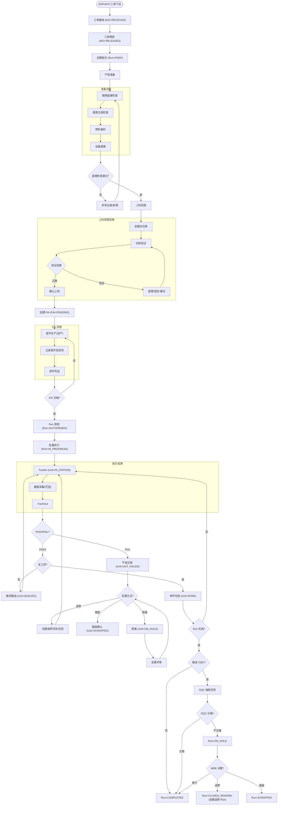

# SMT 产线执行流程

## 说明

- 本文定义 SMT 产线的目标流程（diagram + 关键约束），不包含实现进度与接口清单。
- Run 授权门禁：就绪检查通过 + FAI 通过。授权接口会在缺少 Formal 就绪检查时自动触发一次 Formal 检查。
- 就绪检查项由 `Run.meta.readinessChecks.enabled` 控制；支持的项包含：STENCIL、SOLDER_PASTE、EQUIPMENT、MATERIAL、ROUTE、LOADING。
- Run 状态流转：`PREP`(创建) → `AUTHORIZED`(授权) → `IN_PROGRESS`(首个 TrackIn) → `COMPLETED`/`ON_HOLD`/`CLOSED_REWORK`/`SCRAPPED`。
- OQC 触发：当 `track-out` 使 Unit 进入 `DONE` 后，会检查 Run 是否满足“全部 Unit DONE”，满足则按抽样规则创建 OQC；无命中规则则直接完工。
- MRB 决策：`RELEASE`/`REWORK`/`SCRAP`；`REWORK` 会创建返修 Run（`REUSE_PREP`/`FULL_PREP`），并支持在权限允许时豁免返修 Run 的 FAI（需记录原因）。

## References

- 实现对齐: `spec/impl_align/03_smt_align.md`
- 任务追踪: `plan/tasks.md.md`
