# DIP 产线执行流程 (DIP Flow v1)

> **版本**: v1.1 - 架构对齐版
> **来源**: 用户提供的流程图，经补全闭环和规范化
> **设计原则**: 
> - 融入现有 MES 架构（WorkOrder/Run/Unit + Routing/Track + Inspection）
> - SMT + DIP 作为同一 Run 的不同工序段
> - Run 仅支持一次 FAI；若 DIP 为 Run 首段，则插件首件=FAI；后焊/测试首件用 IPQC
> **里程碑**: M1 基础状态机，M2 扩展状态/OQC/IPQC，M3 数据采集
> **关联文档**: `conversation/new_flow_waiting_review.md`
> **架构对齐**: 与现有 schema.prisma 和 fai/execution 服务对齐

---

## 变更日志

| 版本 | 变更内容 |
|------|----------|
| v1.1 | **架构对齐版**：SMT+DIP 同 Run；Run 仅一次 FAI；后焊/测试首件用 IPQC |
| v1.0 | 初始版本：补全流程闭环，标注统一，多工序段设计 |

---

## 架构定位

```
┌─────────────────────────────────────────────────────────────────┐
│                     MES 执行层 (DIP 工序)                        │
│  ┌──────────────┐ ┌──────────────┐ ┌──────────────┐            │
│  │ 工单/批次    │ │ TrackIn/Out  │ │ 不良/处置    │            │
│  │ 状态管理     │ │ 执行追溯     │ │ 质量卡控     │            │
│  └──────────────┘ └──────────────┘ └──────────────┘            │
│  ┌──────────────┐ ┌──────────────┐ ┌──────────────┐            │
│  │ 首件与检验  │ │ 插件防错     │ │ OQC 抽检     │            │
│  │ (FAI/IPQC)  │ │ (MES 核心)   │ │ (MES 核心)   │            │
│  └──────────────┘ └──────────────┘ └──────────────┘            │
└─────────────────────────────────────────────────────────────────┘
         ↑ 集成接口 (自动) / 手动录入 (降级模式) ↓
┌──────────────┐  ┌──────────────┐  ┌──────────────┐  ┌──────────┐
│  WMS/物料    │  │  TPM/工装    │  │  SCADA/数采  │  │   BI     │
│  插件物料    │  │  夹具状态    │  │  AOI/ICT/FCT │  │  OEE     │
│  (未来集成)  │  │  (未来集成)  │  │  (未来集成)  │  │ (未来)   │
└──────────────┘  └──────────────┘  └──────────────┘  └──────────┘
```

**DIP 工序特点**：
- **前道接收**：从 SMT 工序接收半成品 PCB 板
- **多工序段**：插件段 → 波峰焊接段 → 后焊段 → 测试段
- **首件机制**：Run 级 FAI（一次）+ 段首件 IPQC（可多次）
- **质检密集**：炉前 AOI、炉后 AOI、外观检查、ICT/FCT 测试

---

## 主流程图

```mermaid
flowchart TD
    Start(["DIP工单接收<br>来自SMT工序"]) --> A["DIP产线准备"]
    
    subgraph A_Sub [产线准备流程]
        direction TB
        A1["PCB接收确认<br>• 扫码接收SMT板<br>• 数量核对<br>• 外观检查"]
        A2["插件物料准备<br>• 物料齐套检查<br>• 物料扫码<br>• 存储条件确认"]
        A3["波峰焊设备就绪<br>• 焊接程序加载<br>• 助焊剂检查<br>• 炉温曲线验证"]
        A4["工装夹具准备<br>• 夹具选择<br>• 夹具状态确认<br>• 定位治具校准"]
        
        A1 --> A2 --> A3 --> A4
    end
    
    A --> A1
    
    A4 --> B["插件段首件检查（FAI/IPQC）"]
    
    subgraph B_Sub [插件首件流程]
        direction TB
        B1["首件生产<br>• 选择首件UNIT<br>• 标记首件状态"]
        B2["插件作业<br>• AI视觉辅助<br>• 手工插件<br>• 异形件处理"]
        B3["首件检验<br>• 插件方向<br>• 插件位置<br>• 元件规格"]
        B4["质检员确认"]
        
        B1 --> B2 --> B3 --> B4
    end
    
    B --> B1
    
    B4 --> C{"首件是否合格?"}
    C -->|合格| D["插件段放行"]
    C -->|不合格| E["参数调整与重做"]
    E --> B1
    
    D --> F["插件作业执行"]
    
    subgraph F_Sub [插件作业流程]
        direction TB
        F1["AI辅助插件<br>• 视觉识别<br>• 位置引导<br>• 实时监控"]
        F2["手工插件<br>• 作业指导书<br>• 防呆防错<br>• 过程监控"]
        F3["异形件插件<br>• 特殊工艺<br>• 专用工装<br>• 质量确认"]
        
        F1 --> F2 --> F3
    end
    
    F --> F1
    
    F3 --> G["炉前AOI检查"]
    
    subgraph G_Sub [炉前AOI流程]
        direction TB
        G1["扫码识别<br>• UNIT扫码进站<br>• 检测项目加载"]
        G2["插件质量检查<br>• 元件缺失检测<br>• 插件方向检测<br>• 位置偏移检测"]
        G3["缺陷记录<br>• 缺陷类型<br>• 缺陷位置<br>• 缺陷绑定<br>• 数据上传"]
        
        G1 --> G2 --> G3
    end
    
    G --> G1
    
    G3 --> H{AOI结果?}
    H -->|合格| I["波峰焊接"]
    H -->|不合格| J["插件返修"]
    
    J --> K{"返修结果"}
    K -->|合格| I
    K -->|报废| L["报废处理"]
    L --> End1(["DIP异常结束"])
    
    subgraph I_Sub [波峰焊接流程]
        direction TB
        I1["焊接前准备<br>• 夹具装载<br>• 助焊剂涂覆<br>• 预热设置"]
        I2["波峰焊接<br>• 焊接参数监控<br>• 温度曲线记录<br>• 过程追溯"]
        I3["焊接后处理<br>• 冷却处理<br>• 卸载夹具<br>• 外观初检"]
        
        I1 --> I2 --> I3
    end
    
    I --> I1
    
    I3 --> M["炉后AOI检查"]
    
    subgraph M_Sub [炉后AOI流程]
        direction TB
        M1["扫码识别<br>• UNIT扫码进站"]
        M2["焊接质量检查<br>• 焊点质量<br>• 桥连检测<br>• 漏焊检测"]
        M3["元件状态检查<br>• 元件缺失<br>• 元件偏移<br>• 元件损坏"]
        M4["缺陷记录<br>• 缺陷绑定<br>• 数据上传"]
        
        M1 --> M2 --> M3 --> M4
    end
    
    M --> M1
    
    M4 --> N{AOI结果?}
    N -->|合格| O["后焊工序"]
    N -->|不合格| P["焊接返修"]
    
    P --> Q{"返修结果"}
    Q -->|合格| O
    Q -->|报废| R["报废处理"]
    R --> End1
    
    subgraph O_Sub [后焊准备]
        direction TB
        O1["后焊设备准备<br>• 烙铁温度设置<br>• 工具准备<br>• 三防漆准备"]
        O2["作业指导加载<br>• 后焊工艺文件<br>• 质量标准"]
        
        O1 --> O2
    end
    
    O --> O1
    
    O2 --> W["后焊首件检查（IPQC）"]
    
    subgraph W_Sub [后焊首件流程]
        direction TB
        W1["首件生产<br>• 选择首件UNIT<br>• 标记首件状态"]
        W2["后焊作业<br>• 手工焊接<br>• 剪脚处理<br>• 三防漆喷涂"]
        W3["首件检验<br>• 焊接质量<br>• 三防漆覆盖<br>• 工艺符合性"]
        W4["质检员确认"]
        
        W1 --> W2 --> W3 --> W4
    end
    
    W --> W1
    
    W4 --> X{"首件是否合格?"}
    X -->|合格| Y["后焊段放行"]
    X -->|不合格| Z["参数调整与重做"]
    Z --> W1
    
    Y --> AA["后焊设备设置"]
    
    subgraph AA_Sub [后焊设备]
        direction TB
        AA1["烙铁温度校准"]
        AA2["喷涂参数设置"]
        
        AA1 --> AA2
    end
    
    AA --> AA1
    
    AA2 --> AB["后焊作业执行"]
    
    subgraph AB_Sub [后焊作业流程]
        direction TB
        AB1["手工焊接<br>• 补焊漏焊点<br>• 特殊元件焊接<br>• 过程监控"]
        AB2["剪脚处理<br>• 多余引脚剪切<br>• 焊点修整"]
        AB3["三防漆喷涂<br>• 喷涂区域确认<br>• 喷涂厚度控制<br>• 过程追溯"]
        
        AB1 --> AB2 --> AB3
    end
    
    AB --> AB1
    
    AB3 --> AC["固化处理"]
    
    subgraph AC_Sub [固化流程]
        direction TB
        AC1["进入固化炉<br>• 温度设置<br>• 时间设置"]
        AC2["固化过程监控<br>• 温度曲线记录<br>• 时间记录"]
        AC3["固化完成<br>• 冷却处理<br>• 质量初检"]
        
        AC1 --> AC2 --> AC3
    end
    
    AC --> AC1
    
    AC3 --> AD{"是否需要补充作业?"}
    AD -->|是| AB
    AD -->|否| AE["外观检查"]
    
    subgraph AE_Sub [外观检查流程]
        direction TB
        AE1["扫码进站<br>• UNIT扫码识别"]
        AE2["人工外观检验<br>• 元件完整性<br>• 焊接质量<br>• 三防漆覆盖<br>• 标识清晰度"]
        AE3["检验记录<br>• 检验结果录入<br>• 不良标记<br>• 数据上传"]
        
        AE1 --> AE2 --> AE3
    end
    
    AE --> AE1
    
    AE3 --> AF{外观结果?}
    AF -->|合格| AG["功能测试"]
    AF -->|不合格| AH["外观返修"]
    
    AH --> AI{"返修结果"}
    AI -->|合格| AG
    AI -->|报废| AJ["报废处理"]
    AJ --> End1
    
    subgraph AG_Sub [测试准备]
        direction TB
        AG1["测试设备准备<br>• ICT设备检查<br>• FCT设备检查<br>• 夹具准备"]
        AG2["测试程序加载<br>• 测试项目确认<br>• 参数设置"]
        
        AG1 --> AG2
    end
    
    AG --> AG1
    
    AG2 --> LL["测试首件检查（IPQC）"]
    
    subgraph LL_Sub [测试首件流程]
        direction TB
        LL1["首件选择<br>• 选择首件UNIT<br>• 标记首件状态"]
        LL2["首件测试<br>• ICT测试<br>• FCT测试<br>• 性能验证"]
        LL3["测试数据分析<br>• 测试结果评估<br>• 参数合理性确认"]
        LL4["质检员确认"]
        
        LL1 --> LL2 --> LL3 --> LL4
    end
    
    LL --> LL1
    
    LL4 --> MM{"测试首件结果"}
    MM -->|合格| NN["批量测试放行"]
    MM -->|不合格| OO["测试调整与重做"]
    OO --> LL1
    
    NN --> PP["执行批量测试"]
    
    subgraph PP_Sub [测试项目执行]
        direction TB
        PP1["ICT在线测试<br>• 测试夹具管理<br>• 测试数据采集<br>• 不良自动标记"]
        PP2["功能测试<br>• FCT测试执行<br>• 性能参数验证<br>• 安全测试"]
        PP3["测试数据绑定<br>• 测试结果记录<br>• 数据上传<br>• 产品追溯绑定"]
        
        PP1 --> PP2 --> PP3
    end
    
    PP --> PP1
    
    PP3 --> QQ{"批量测试结果"}
    QQ -->|合格| RR["测试完成确认"]
    QQ -->|不合格| SS["测试返修"]
    
    SS --> TT{"返修结果"}
    TT -->|合格| RR
    TT -->|报废| UU["报废处理"]
    UU --> End1
    
    RR --> VV{Run完成?}
    VV -->|否| PP
    VV -->|是| WW{触发OQC?}
    
    WW -->|否| XX["DIP完工<br>RUN=COMPLETED"]
    WW -->|是| YY["OQC抽检"]
    
    subgraph YY_Sub [OQC抽检流程]
        direction TB
        YY1["抽样计划执行"]
        YY2["抽样检验<br>• 外观复检<br>• 功能复测<br>• 尺寸检查"]
        YY3["检验结果判定"]
        
        YY1 --> YY2 --> YY3
    end
    
    YY --> YY1
    
    YY3 --> ZZ{OQC结果?}
    ZZ -->|合格| XX
    ZZ -->|不合格| AAA["批次隔离<br>RUN=ON_HOLD"]
    
    AAA --> BBB["MRB评审"]
    BBB --> CCC{MRB决策?}
    CCC -->|放行| XX
    CCC -->|返修| DDD["创建返修批次<br>原RUN=CLOSED_REWORK"]
    DDD --> A
    CCC -->|报废| EEE["整批报废<br>RUN=SCRAPPED"]
    EEE --> End1
    
    XX --> End2(["DIP完工<br>转入下工序"])
```



---

## 工序段划分与路由设计

### SMT + DIP 完整路由结构

DIP 产线作为 SMT 的后续工序，**与 SMT 共享同一个 Run**，通过 `RoutingStep.meta.stepGroup`（JSON）标识工序段：

| 工序段编号 | 工序段名称 | 关键工序 | stepGroup 标识 | FAI/IPQC 要求 | 质检点 |
|-----------|-----------|---------|---------------|--------------|--------|
| SMT | SMT 贴片段 | 钢网准备、锡膏印刷、贴片、回流焊 | `"SMT"` | SMT 首件检查（FAI） | SPI/AOI |
| DIP-1 | 插件段 | AI辅助插件、手工插件、异形件插件 | `"DIP-1"` | 插件段首件（FAI/IPQC，见下） | 炉前 AOI |
| DIP-2 | 波峰焊接段 | 助焊剂涂覆、波峰焊接、冷却 | `"DIP-2"` | - | 炉后 AOI |
| DIP-3 | 后焊段 | 手工焊接、剪脚、三防漆喷涂、固化 | `"DIP-3"` | 后焊首件检查（**IPQC**） | 外观检查 |
| DIP-4 | 测试段 | ICT 测试、FCT 测试 | `"DIP-4"` | 测试首件检查（**IPQC**） | 功能测试 |

### 首件检验机制对齐

| 检验类型 | 范围 | 目的 | 是否卡控 Run 授权 | 数据库存储 |
|---------|------|------|------------------|-----------|
| **FAI** | Run 级（一次） | 开工前首件验证（程序/参数/工艺） | ✅ 是（PREP → AUTHORIZED） | `Inspection.type = FAI`，`activeKey = ${runId}:FAI` |
| **IPQC** | stepNo/工序段级（可多次） | 段首件/过程参数验证 | ❌ 否（记录为检验项，可做软提示/软卡控） | `Inspection.type = IPQC`（规划），`activeKey = ${runId}:IPQC:${stepNo}` |

**DIP 落地约束**（与现有实现一致）：
- 当前系统只支持 **Run 级 FAI（一次性）**：只要路由任一 step 标记 `requiresFAI=true`，Run 在授权前必须有 PASS 的 FAI；不支持“到某个工序段再做一次独立 FAI”。
- 因此在 **SMT+DIP 组合路由** 场景下，DIP 段的段首件（插件/后焊/测试）推荐统一用 **IPQC** 记录；若产品是 **DIP-only** 且 DIP 为 Run 首段，则“插件段首件”可视为该 Run 的 FAI。

**推荐检查点**：
- SMT 首件：验证贴片程序、焊接参数（FAI）
- DIP-1 插件段首件：验证插件工艺、AI 识别准确性（IPQC）
- DIP-3 后焊首件：验证烙铁温度、三防漆喷涂参数（IPQC）
- DIP-4 测试首件：验证测试程序正确性（IPQC）

### 为什么这样设计？

**系统架构约束**：
- 现有 `Inspection.activeKey = ${runId}:${type}`，同一 Run 的 FAI 只有一个活跃通道
- `createFai` 要求 `run.status === PREP`，无法在 Run 进入 IN_PROGRESS 后再创建 FAI
- `checkFaiGate` 只在 Run 授权时检查一次，不支持工序段级别的卡控

**业务合理性**：
- DIP-1 插件段首件也是 DIP 工序的“开工前检查”；在 SMT+DIP 同 Run 下用 IPQC 记录/提示更合适；若 DIP-only 且为首段，可视为该 Run 的 FAI
- DIP-3/DIP-4 首件主要验证工艺参数，用 IPQC 记录即可满足质量追溯需求
- 如果后焊/测试首件不合格，可通过返修流程处理，无需暂停整个 Run

---

## SMT + DIP 同 Run 的数据流转

### 路由结构示例

```json
{
  "routingId": "routing-smt-dip",
  "routingCode": "SMT_DIP_V1",
  "steps": [
    // SMT 工序段
    { "stepNo": 10, "operationCode": "STENCIL_PREP", "meta": { "stepGroup": "SMT" } },
    { "stepNo": 20, "operationCode": "SPI", "meta": { "stepGroup": "SMT" } },
    { "stepNo": 30, "operationCode": "SMT_PLACEMENT", "requiresFAI": true, "meta": { "stepGroup": "SMT" } },
    { "stepNo": 40, "operationCode": "AOI", "meta": { "stepGroup": "SMT" } },
    { "stepNo": 50, "operationCode": "REFLOW", "meta": { "stepGroup": "SMT" } },
    
    // DIP 工序段
    { "stepNo": 110, "operationCode": "DIP_PREP", "meta": { "stepGroup": "DIP-1" } },
    { "stepNo": 120, "operationCode": "DIP_INSERTION", "meta": { "stepGroup": "DIP-1", "requiresIPQC": true } },
    { "stepNo": 130, "operationCode": "PRE_WAVE_AOI", "meta": { "stepGroup": "DIP-1" } },
    { "stepNo": 140, "operationCode": "WAVE_SOLDERING", "meta": { "stepGroup": "DIP-2" } },
    { "stepNo": 150, "operationCode": "POST_WAVE_AOI", "meta": { "stepGroup": "DIP-2" } },
    { "stepNo": 160, "operationCode": "POST_WELDING", "meta": { "stepGroup": "DIP-3", "requiresIPQC": true } },
    { "stepNo": 170, "operationCode": "VISUAL_INSPECTION", "meta": { "stepGroup": "DIP-3" } },
    { "stepNo": 180, "operationCode": "ICT", "meta": { "stepGroup": "DIP-4", "requiresIPQC": true } },
    { "stepNo": 190, "operationCode": "FCT", "meta": { "stepGroup": "DIP-4" } }
  ]
}
```

### Unit 流转过程

```
同一个 SN（Unit.sn）在同一个 Run 中：
┌─────────────────────────────────────────────────────────────┐
│ Unit: SN001                                                  │
│   runId: run-xxx (固定不变)                                  │
│   currentStepNo: 10 → 20 → 30 → ... → 190                   │
│   status: QUEUED → IN_STATION → QUEUED → ... → DONE         │
└─────────────────────────────────────────────────────────────┘

Track 记录（每件每步 TrackIn/Out）：
- stepNo: 10 (SMT 钢网准备)
- stepNo: 20 (SPI)
- stepNo: 30 (SMT 贴片) ← SMT FAI 检查点
- ...
- stepNo: 110 (DIP 准备)
- stepNo: 120 (插件作业) ← DIP-1 段首件 IPQC 检查点
- ...
- stepNo: 160 (后焊作业) ← DIP-3 IPQC 检查点
- stepNo: 180 (ICT 测试) ← DIP-4 IPQC 检查点
```

### FAI vs IPQC 的实现对比

| 维度 | FAI（Run 级） | IPQC（段首件） |
|------|----------------|---------------------|
| 触发时机 | Run=PREP 时，授权前 | 执行到指定 stepNo 前（软提示/软卡控） |
| 卡控方式 | 卡控 Run 授权（PREP → AUTHORIZED） | 不影响 Run 授权，仅记录检验结果 |
| 数据库记录 | `Inspection.type = FAI` | `Inspection.type = IPQC` |
| activeKey | `${runId}:FAI` | `${runId}:IPQC:${stepNo}` |
| API 端点 | `POST /api/fai/run/{runNo}` + `POST /api/runs/{runNo}/authorize` | ⬜ 规划：`/api/ipqc/...`（详见 `conversation/dip_architecture_alignment.md`） |
| 不合格处理 | 不允许授权，必须复检通过 | 记录不良，可调整参数后复检 |

---

## 状态机映射

状态枚举以 `domain_docs/mes/spec/process/02_state_machines.md` 为准；本文仅列 DIP 相关触发点与接口。

### RunStatus（批次）

| 状态 | 触发点 | 备注 | 相关接口/事件 |
|------|--------|------|--------------|
| `PREP` | 创建 Run | 绑定可执行路由版本 | `POST /api/work-orders/{woNo}/runs` |
| `AUTHORIZED` | 就绪检查 + FAI 通过后授权 | 授权与 FAI 解耦：FAI 通过后再调用授权接口 | `POST /api/fai/{faiId}/complete` + `POST /api/runs/{runNo}/authorize` |
| `IN_PROGRESS` | 首个 TrackIn | 自动触发 | `POST /api/stations/{stationCode}/track-in` |
| `COMPLETED` | 无 OQC 规则自动完工 / OQC 通过 | 无采样规则：自动置为 COMPLETED；有采样规则：OQC PASS 后置为 COMPLETED | `POST /api/oqc/{oqcId}/complete`（PASS） |
| `ON_HOLD` | OQC 不合格 | 进入 MRB 评审 | `POST /api/oqc/{oqcId}/complete`（FAIL） |
| `CLOSED_REWORK` | MRB 决策返修 | 原 Run 终态；创建返修 Run | `POST /api/runs/{runNo}/mrb-decision`（REWORK） |
| `SCRAPPED` | MRB 决策报废 | 原 Run 终态 | `POST /api/runs/{runNo}/mrb-decision`（SCRAP） |

### UnitStatus（单件）

| 状态 | 触发点 | 备注 | 相关接口/事件 |
|------|--------|------|--------------|
| `QUEUED` | 初始/过站 PASS（非末工序）/返修回流 | 返修通过后回到待加工 | `POST /api/stations/{stationCode}/track-out`（PASS） |
| `IN_STATION` | TrackIn | 进站加工 | `POST /api/stations/{stationCode}/track-in` |
| `OUT_FAILED` | TrackOut(FAIL) | 默认自动创建 Defect | `POST /api/stations/{stationCode}/track-out`（FAIL） |
| `DONE` | TrackOut(PASS, 末工序) | 触发 OQC 判定/自动完工 | `POST /api/stations/{stationCode}/track-out`（PASS） |
| `ON_HOLD` | 不良处置=HOLD | 单件隔离 | `POST /api/defects/{defectId}/disposition`（HOLD） |
| `SCRAPPED` | 不良处置=SCRAP | 单件报废 | `POST /api/defects/{defectId}/disposition`（SCRAP） |

**返修（REWORK）**：
- Unit 不新增 `REWORK` 状态；处置为 `DispositionType.REWORK` 时创建 `ReworkTask`，并将 Unit 回到 `QUEUED` 且回退 `currentStepNo`。
- 返修完成：`POST /api/rework-tasks/{taskId}/complete`。

---

## IPQC（段首件）实现方案（规划）

复用 `Inspection` 模型：
- `Inspection.type = IPQC`
- `Inspection.data` 存储 `{ stepNo, stepGroup, checkType, unitSn }`
- `activeKey = ${runId}:IPQC:${stepNo}`（同一 Run 可有多个 IPQC；按 stepNo 区分）

备注：IPQC API/UI 尚未实现；详见 `conversation/dip_architecture_alignment.md`。

---

## 质检点详细规范

> 说明：当前 MES 侧的落库接口是 `track-out` 的 `data[]`（写入 `DataValue`）以及 `defectCode/defectLocation`（自动生成 `Defect`）。下述 JSON 用于说明推荐的“设备侧数据字段”，实际接入时需映射为 `track-out` payload（可结合 `DataCollectionSpec` / `dataSpecIds` 做字段约束）。

### 1. 炉前 AOI（插件质量检查）

**检查项目**：
- 元件缺失检测
- 插件方向检测（极性元件）
- 位置偏移检测
- 元件规格检测

**设备侧原始数据示例（需映射到 `track-out.data[]`）**：
```json
{
  "inspectionType": "PRE_WAVE_AOI",
  "unitId": "unit-xxx",
  "stepId": "step-dip-aoi-pre",
  "result": "PASS" | "FAIL",
  "defects": [
    {
      "type": "MISSING_COMPONENT",
      "location": "C12",
      "severity": "CRITICAL"
    }
  ],
  "imageUrls": ["..."],
  "timestamp": "2026-01-06T10:00:00Z"
}
```

### 2. 炉后 AOI（焊接质量检查）

**检查项目**：
- 焊点质量（饱满度、润湿性）
- 桥连检测（短路风险）
- 漏焊检测
- 元件损坏检测

**设备侧原始数据示例（需映射到 `track-out.data[]`）**：类似炉前 AOI，`inspectionType: "POST_WAVE_AOI"`

### 3. 外观检查（人工 100% 检验）

**检查项目**：
- 元件完整性
- 焊接质量（目视）
- 三防漆覆盖均匀性
- 标识清晰度（丝印、贴标）

**录入数据示例（需映射到 `track-out.data[]`）**：
```json
{
  "inspectionType": "VISUAL_INSPECTION",
  "unitId": "unit-xxx",
  "inspectorId": "user-xxx",
  "result": "PASS" | "FAIL",
  "checkItems": [
    { "item": "三防漆覆盖", "result": "OK" },
    { "item": "焊点外观", "result": "NG", "comment": "C15焊点不饱满" }
  ],
  "timestamp": "2026-01-06T11:00:00Z"
}
```

### 4. ICT/FCT 测试

**ICT（In-Circuit Test）**：
- 元件焊接质量（电气连通性）
- 元件参数（阻值、容值）
- 短路/开路检测

**FCT（Functional Test）**：
- 功能验证（按功能模块）
- 性能参数（电压、电流、频率）
- 安全测试（耐压、绝缘）

**设备侧原始数据示例（需映射到 `track-out.data[]`）**：
```json
{
  "testType": "ICT" | "FCT",
  "unitId": "unit-xxx",
  "testProgramId": "program-xxx",
  "result": "PASS" | "FAIL",
  "testItems": [
    {
      "item": "R15电阻值",
      "expected": "10K±5%",
      "actual": "10.2K",
      "result": "PASS"
    },
    {
      "item": "输出电压",
      "expected": "5V±0.1V",
      "actual": "5.15V",
      "result": "FAIL"
    }
  ],
  "rawDataUrl": "...",
  "timestamp": "2026-01-06T12:00:00Z"
}
```

---

## OQC 抽检触发规则

对齐现有实现（与 SMT 相同）：

- **触发时机**：当 `Run.status = IN_PROGRESS` 且该 Run 下所有 `Unit.status = DONE`，系统会在最后一次 `track-out` 后自动执行 OQC 触发检查。
- **规则来源**：`OqcSamplingRule`（可按 `productCode / lineId / routingId` 配置；按“匹配特异度 + priority + createdAt”选中一条）。
- **无命中规则**：不创建 OQC，系统会直接把 `Run.status` 置为 `COMPLETED`（自动完工）。
- **命中规则**：创建 `Inspection.type = OQC` 任务，并随机抽样 Unit（Fisher-Yates shuffle）。
- **抽样数量**：
  - `PERCENTAGE`：`ceil(unitCount * sampleValue / 100)`（最少 1，最多 unitCount）
  - `FIXED`：`min(sampleValue, unitCount)`
- **OQC 完成**：
  - `PASS` → `Inspection.status = PASS`，`Run.status = COMPLETED`（写 `endedAt`）
  - `FAIL` → `Inspection.status = FAIL`，`Run.status = ON_HOLD`（进入 MRB 决策）

---

## 返修流程

> 说明：当前系统将“返修”拆成两个层级：**单件缺陷处置**（Defect/Disposition/ReworkTask）与 **批次 MRB 返修 Run**（OQC FAIL → MRB）。

### A. 单件缺陷处置（Defect / Disposition / ReworkTask）

- **触发来源**：
  - `track-out` 结果为 `FAIL` 时，系统会自动创建一条 `Defect`（`defectCode` 默认 `STATION_FAIL`，可随 TrackOut 提交）。
  - 也可手动创建 `Defect`（用于补录/设备接口对接等）。
- **处置类型**（`Disposition.type`）：
  - `REWORK`：创建 `ReworkTask`，并将 `Unit.status` 置为 `QUEUED`，`Unit.currentStepNo` 回退到 `toStepNo`（默认 1）。
  - `HOLD`：将 `Unit.status` 置为 `ON_HOLD`，后续通过 release 放行（放行会关闭 defect）。
  - `SCRAP`：将 `Unit.status` 置为 `SCRAPPED` 并关闭 defect。
- **返修完成**：
  - `ReworkTask` 完成后，`Unit.status` 回到 `QUEUED`，`Defect.status` 置为 `CLOSED`。

### B. 批次 MRB 返修 Run（OQC FAIL → MRB Decision）

- **触发条件**：`Run.status = ON_HOLD` 且该 Run 存在 `Inspection.type = OQC` 且 `Inspection.status = FAIL` 的记录。
- **MRB 决策**：
  - `RELEASE`：`Run.status = COMPLETED`（批次放行）
  - `SCRAP`：`Run.status = SCRAPPED`，并将该 Run 下所有 `Unit.status` 置为 `SCRAPPED`
  - `REWORK`：`Run.status = CLOSED_REWORK`，并创建返修 Run：`{parentRunNo}-RW{seq}`
    - `reworkType = REUSE_PREP`：新 Run 初始 `status = AUTHORIZED`（跳过 PREP/FAI）
    - `reworkType = FULL_PREP`：新 Run 初始 `status = PREP`（走完整 PREP→FAI→授权）
    - 创建返修 Run 会把 parent Run 下的 Unit **整体迁移**到新 Run（`Unit.runId` 更新；`currentStepNo` 回到路由第一步）
    - 可选：MRB 可对 `REUSE_PREP` 返修设置 `FAI waiver`（需要 `QUALITY_DISPOSITION` 权限，并提供原因）

---

## API 端点总览

> 说明：所有 MES API 均在 `/api` 下；当前没有 `/api/mes/*` 前缀。

| 功能 | 端点 | 方法 | 备注 |
|------|------|------|------|
| Run 授权 | `/api/runs/:runNo/authorize` | POST | `{"action":"AUTHORIZE"}`；会检查 FAI gate |
| Unit 进站 | `/api/stations/:stationCode/track-in` | POST | `Unit.status → IN_STATION` |
| Unit 出站 | `/api/stations/:stationCode/track-out` | POST | `FAIL` 会自动建 Defect；Unit `DONE` 后会触发 OQC 检查 |
| FAI gate | `/api/fai/run/:runNo/gate` | GET | Run 级 gate |
| FAI 创建 | `/api/fai/run/:runNo` | POST | 仅 `Run.status = PREP` 可创建 |
| FAI 执行 | `/api/fai/:faiId/start` | POST |  |
|  | `/api/fai/:faiId/items` | POST |  |
|  | `/api/fai/:faiId/complete` | POST |  |
| OQC 查询 | `/api/oqc/run/:runNo` | GET |  |
| OQC gate | `/api/oqc/run/:runNo/gate` | GET | Run 完工 gate |
| OQC 创建（手动） | `/api/oqc/run/:runNo` | POST | 自动触发在 `track-out` 内 |
| OQC 执行 | `/api/oqc/:oqcId/start` | POST |  |
|  | `/api/oqc/:oqcId/items` | POST |  |
|  | `/api/oqc/:oqcId/complete` | POST |  |
| OQC 抽样规则 | `/api/oqc/sampling-rules` | GET/POST |  |
|  | `/api/oqc/sampling-rules/:ruleId` | GET/PATCH/DELETE |  |
| MRB 决策 | `/api/runs/:runNo/mrb-decision` | POST | 仅 `Run.status = ON_HOLD` |
| 创建返修 Run | `/api/runs/:runNo/rework` | POST | 仅 `Run.status = ON_HOLD` 且需 `mrbDecisionId` |
| 查询返修 Run | `/api/runs/:runNo/rework-runs` | GET |  |
| 缺陷 | `/api/defects` | GET/POST |  |
| 缺陷处置 | `/api/defects/:defectId/disposition` | POST | `REWORK/HOLD/SCRAP` |
| 放行 HOLD | `/api/defects/:defectId/release` | POST |  |
| 返修任务 | `/api/rework-tasks` | GET |  |
|  | `/api/rework-tasks/:taskId/complete` | POST |  |
| （规划）IPQC | `/api/ipqc/...` | - | 见“IPQC（段首件）实现方案（规划）” |

---

## 与现有文档的整合

### 与 01_end_to_end_flows.md 的关系

- `01_end_to_end_flows.md` 定义通用的 **WO → Run → UNIT** 流转逻辑
- `04_dip_flows.md` 在此基础上补充 DIP 工序的“路由分段 + 质检点”细节，并复用现有实现的：
  - Run 状态机：`PREP → AUTHORIZED → IN_PROGRESS → (COMPLETED | ON_HOLD | CLOSED_REWORK | SCRAPPED)`
  - Unit 状态机：`QUEUED ↔ IN_STATION → (QUEUED | OUT_FAILED | DONE | ON_HOLD | SCRAPPED)`
  - 执行与追溯：`Track`（进/出站）、`DataValue`（数据采集）、`Defect/Disposition/ReworkTask`（不良与返修）

### 与 03_smp_flows.md 的关系

- `03_smp_flows.md` 是 SMT 产线的详细流程
- `04_dip_flows.md` 与其平行，共享：
  - OQC 抽检机制
  - MRB 决策流程
  - 返修 Run 创建逻辑
  - Run 级首件检验（FAI，仅一次）；工序段首件用 IPQC（规划）

**关键差异**：

| 维度 | SMT (03_smp_flows.md) | DIP (04_dip_flows.md) |
|------|----------------------|----------------------|
| 工序段 | 单段（贴片） | 多段（插件/焊接/后焊/测试） |
| FAI 次数 | 1 次（Run 级） | 1 次（Run 级） |
| 段首件检验 | - | 可选：IPQC（规划：插件段/后焊段/测试段） |
| 主要质检 | SPI/AOI | 炉前AOI/炉后AOI/外观/ICT/FCT |
| 防错重点 | 上料防错 | 插件防错 |

---

## 里程碑规划

| 里程碑 | 功能范围 | DIP 相关 |
|-------|---------|---------|
| **M1** | 路由分段建模 + TrackIn/Out + Run 级 FAI | ✅ DIP 作为路由后半段接入；定义站点约束与采集项 |
| **M2** | OQC 抽检 + MRB 决策 + 返修 Run | ✅ 与 SMT 相同；为 DIP routing 配置 `OqcSamplingRule` |
| **M3** | 设备数据接入 + 段首件 IPQC（规划） | ✅ AOI/ICT/FCT 自动上传；IPQC 任务与 UI 提示 |

---

## 下一步行动

1. **路由与执行配置**：
   - 路由步骤按工序段写入 `RoutingStep.meta.stepGroup`（如 `DIP-1/DIP-2/...`），并按需要设置 `meta.requiresIPQC`（规划字段）
   - 用 `RouteExecutionConfig` 约束站点范围，并为 AOI/测试步骤配置 `dataSpecIds`

2. **OQC 抽样规则**：
   - 为 DIP 路由创建/调整 `OqcSamplingRule`（可按产品/产线/路由精确匹配）

3. **IPQC（规划）**：
   - 复用 `Inspection` 增加 IPQC service/routes/UI（见上文“IPQC（段首件）实现方案（规划）”）
   - 在执行端（UI 或 `track-in`）提示工序段首件需完成 IPQC（非 Run 授权 gate）

4. **设备数据接入（规划/增强）**：
   - 将 AOI/ICT/FCT 结果映射为 `track-out.data[]`（写入 `DataValue`）+ 必要时创建 `Defect`
   - 如需通用“设备原始报文 → track-out”映射，可补齐 `ingestMapping` 的执行链路

---

## 附录：术语对照

| 中文术语 | 英文术语 | 缩写 | 说明 |
|---------|---------|------|------|
| 插件 | Through-Hole Technology | THT | 插入式元件安装 |
| 波峰焊 | Wave Soldering | - | 插件元件的批量焊接工艺 |
| 后焊 | Post-Soldering | - | 波峰焊后的补焊、剪脚、涂覆工序 |
| 三防漆 | Conformal Coating | - | 防潮、防尘、防腐蚀的保护涂层 |
| 在线测试 | In-Circuit Test | ICT | 电气参数测试 |
| 功能测试 | Functional Test | FCT | 产品功能验证测试 |
| 首件检验 | First Article Inspection | FAI | 批次首件的质量验证 |
| 材料评审委员会 | Material Review Board | MRB | 不合格品的处置决策机构 |

---

## Implementation Status

<!-- 完成 DIP 功能后同步更新此表。Status: ✅ done | ⬜ pending | 🔌 integration -->

### 产线准备 (DIP-1)

| 流程节点 | API | Backend Module | Status | MS | 备注 |
|---------|-----|----------------|--------|-----|------|
| PCB 接收确认 | TrackIn | `execution/service.ts` | ✅ | M1 | 从 SMT 工序接收 |
| 插件物料准备 | 手动确认 | - | ✅ | M1 | 物料齐套检查 |
| 波峰焊设备就绪 | 手动确认 | - | ✅ | M1 | 焊接程序加载 |
| 工装夹具准备 | 手动确认 | - | ✅ | M1 | 夹具状态确认 |

### Run 级首件 (FAI，一次)

| 流程节点 | API | Backend Module | Status | MS | 备注 |
|---------|-----|----------------|--------|-----|------|
| 首件生产（路由首段） | TrackIn/Out | `execution/service.ts` | ✅ | M1 | 取决于 routing 首段（可能是 SMT，也可能是 DIP-only） |
| 创建 FAI | `POST /api/fai/run/{runNo}` | `fai/service.ts` | ✅ | M1 | 仅 `RUN=PREP` 可创建 |
| 完成 FAI | `POST /api/fai/{faiId}/complete` | `fai/service.ts` | ✅ | M1 | 通过后可调用授权接口（FAI 本身不改变 RUN 状态） |

### 插件作业 (DIP-1)

| 流程节点 | API | Backend Module | Status | MS | 备注 |
|---------|-----|----------------|--------|-----|------|
| AI 辅助插件 | TrackIn/Out | `execution/service.ts` | ✅ | M1 | 视觉识别引导 |
| 手工插件 | TrackIn/Out | `execution/service.ts` | ✅ | M1 | 作业指导书 |
| 异形件插件 | TrackIn/Out | `execution/service.ts` | ✅ | M1 | 专用工装 |
| 炉前 AOI 检测 🔌 | `POST /api/data-collection/{unitId}/record` | - | ⬜ | M3 | 插件质量检查 |
| 插件返修 | `POST /api/defects` + Disposition | `defect/service.ts` | ✅ | M2 | - |

### 波峰焊接 (DIP-2)

| 流程节点 | API | Backend Module | Status | MS | 备注 |
|---------|-----|----------------|--------|-----|------|
| 波峰焊接 | TrackIn/Out | `execution/service.ts` | ✅ | M1 | 焊接参数监控 |
| 炉后 AOI 检测 🔌 | `POST /api/data-collection/{unitId}/record` | - | ⬜ | M3 | 焊接质量检查 |
| 焊接返修 | `POST /api/defects` + Disposition | `defect/service.ts` | ✅ | M2 | - |

### 后焊首件 (IPQC) - DIP-3

| 流程节点 | API | Backend Module | Status | MS | 备注 |
|---------|-----|----------------|--------|-----|------|
| 后焊首件生产 | TrackIn/Out | `execution/service.ts` | ✅ | M1 | 标记首件 UNIT |
| 后焊首件检验 | `POST /api/ipqc/run/{runNo}` | **(新增)** | ⬜ | M2 | **需实现 IPQC 服务** |
| 后焊首件完成 | `POST /api/ipqc/{inspectionId}/complete` | **(新增)** | ⬜ | M2 | 软卡控，记录检验结果 |

### 后焊作业 (DIP-3)

| 流程节点 | API | Backend Module | Status | MS | 备注 |
|---------|-----|----------------|--------|-----|------|
| 手工焊接 | TrackIn/Out | `execution/service.ts` | ✅ | M1 | 补焊漏焊点 |
| 剪脚处理 | TrackIn/Out | `execution/service.ts` | ✅ | M1 | 多余引脚剪切 |
| 三防漆喷涂 | TrackIn/Out | `execution/service.ts` | ✅ | M1 | 喷涂区域确认 |
| 固化处理 | TrackIn/Out | `execution/service.ts` | ✅ | M1 | 温度曲线记录 |
| 人工外观检验 | TrackIn/Out + 检验记录 | `execution/service.ts` | ✅ | M2 | 100% 检验 |
| 外观返修 | `POST /api/defects` + Disposition | `defect/service.ts` | ✅ | M2 | - |

### 测试首件 (IPQC) - DIP-4

| 流程节点 | API | Backend Module | Status | MS | 备注 |
|---------|-----|----------------|--------|-----|------|
| 测试首件生产 | TrackIn/Out | `execution/service.ts` | ✅ | M1 | 标记首件 UNIT |
| 测试首件检验 | `POST /api/ipqc/run/{runNo}` | **(新增)** | ⬜ | M2 | **需实现 IPQC 服务** |
| 测试首件完成 | `POST /api/ipqc/{inspectionId}/complete` | **(新增)** | ⬜ | M2 | 软卡控，记录检验结果 |

### 功能测试 (DIP-4)

| 流程节点 | API | Backend Module | Status | MS | 备注 |
|---------|-----|----------------|--------|-----|------|
| ICT 测试 🔌 | `POST /api/data-collection/{unitId}/record` | - | ⬜ | M3 | 电气参数测试 |
| FCT 测试 🔌 | `POST /api/data-collection/{unitId}/record` | - | ⬜ | M3 | 功能验证测试 |
| 测试返修 | `POST /api/defects` + Disposition | `defect/service.ts` | ✅ | M2 | - |

### OQC 与 MRB (DIP-4)

| 流程节点 | API | Backend Module | Status | MS | 备注 |
|---------|-----|----------------|--------|-----|------|
| OQC 创建（自动/手动） | `POST /api/oqc/run/{runNo}` | `oqc/service.ts` | ✅ | M2 | 自动触发：最后一件 Unit=DONE 后；手动创建用于补偿 |
| OQC 完成 | `POST /api/oqc/{oqcId}/complete` | `oqc/service.ts` | ✅ | M2 | - |
| MRB 决策 | `POST /api/runs/{runNo}/mrb-decision` | `oqc/mrb-service.ts` | ✅ | M2 | Run=ON_HOLD 时决策 |
| 创建返修 Run | `POST /api/runs/{runNo}/rework` | `oqc/mrb-service.ts` | ✅ | M2 | - |
