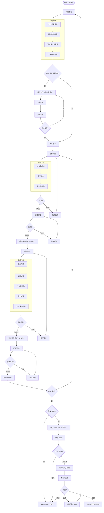

# DIP 产线执行流程

## 说明

- DIP 与 SMT 可处于同一 Run 的组合路由；如需展示/分段，可在 `RoutingStep.meta.stepGroup` 中标注（可选）。
- FAI 为 Run 级（一次）授权门禁；DIP 的“段首件”（后焊/测试）建议用 IPQC 记录，不作为 Run 授权门禁（当前未实现 IPQC）。
- OQC 与 MRB 为 Run 级闭环：OQC 不合格进入 `Run=ON_HOLD`，由 MRB 决策进入 `COMPLETED`/`CLOSED_REWORK`/`SCRAPPED`（返修会创建新的返修 Run）。

## References

- 实现对齐: `spec/impl_align/04_dip_align.md`
- 任务追踪: `plan/tasks.md.md`
